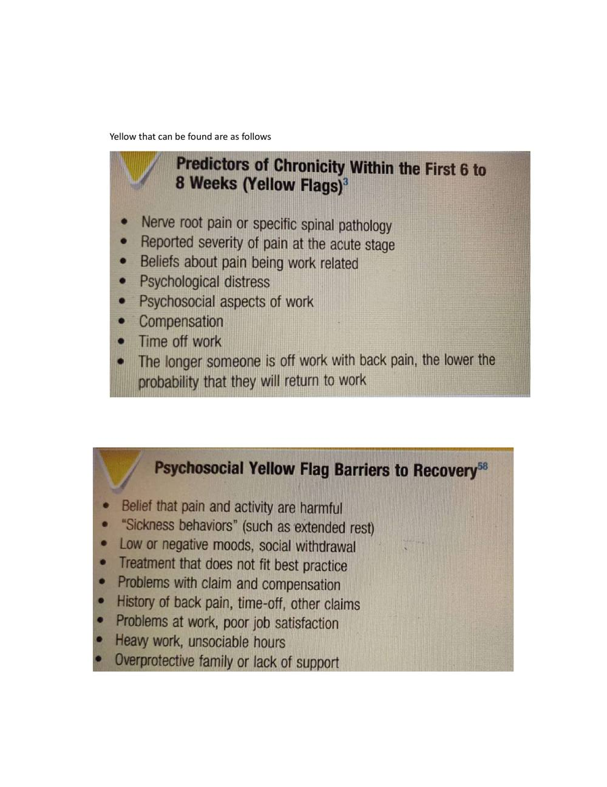

# Screening of Lumbar Spine

> Source: David J. Magee, *Orthopedic Physical Assessment*, 6th ed., and companion MSK assessment material. Paper 3 compilation.

Paper 3 : Screening of Lumbar Spine

## Contents

## Patient History

## Observation

## Examination

## Palpation

## Diagnostic Imaging

## References

## Patient History

1. What is the patient's age? 2. What is the patient's occupation? 3. What is the patient's sex? 4. What was the mechanism of injury? 5. How long has the problem bothered the patient? 6. Where are the sites and boundaries of pain? 7. Is there any radiation of pain? 8. Is the pain deep? Superficial? Shooting? Burning? Aching? 9. Is the pain improving? Worsening? Staying the same? 10.Is there any increase in pain with coughing? Sneezing? Deep breathing? Laughing? 11.Are there any postures or actions that specifically increase or decrease the pain or cause difficulty? 12.Is the pain worse in the morning or evening? 13.Which movements hurt? 14.Which movements are stiff? Is paresthesia (a "pins and needles" feeling) or anesthesia present?

15.Has the patient noticed any weakness or decrease in strength? 16. What is the patient's usual activity or pastime? Before the injury, did the patient modify or perform any unusual repetitive or high-stress activity? 17.Which activities aggravate the pain? Is there anything in the patient's lifestyle that increases the pain? 18.Which activities ease the pain? 19.What is the patient's sleeping position? 20.Does the patient have any difficulty with micturition? 21.Are there any red flags that the examiner should be aware of, such as a history of cancer, sudden weight loss for no apparent reason, immunosuppressive disorder, infection, fever, or bilateral leg weakness? 22.Is the patient receiving any medication?

23.Is the patient able to cope during daily activities? Yellow that can be found are as follows

## OBSERVATION

The patient must be suitably undressed. Males must wear only shorts, and females must wear only a bra and shorts. When doing the observation, the examiner should note the patient's willingness to move and the pattern of movement.

## Body Type

Three general body types Ectomorphic-thin body build, characterized by relative prominence of structures developed from the embryonic ectoderm Mesomorphic-muscular or sturdy body build, characterized by relative prominence of structures developed from the embryonic mesoderm Endomorphic-heavy (fat) body build, characterized by relative prominence of structures developed from the embryonic endoderm.

## Gait

Does the gait appear to be normal when the patient walks into the examination area, or is it altered in some way? If it is altered, the examiner must take time to find out whether the problem is in the limb or whether the gait is altered to relieve symptoms elsewhere.

## Attitude

What is the patient's appearance? Is the patient tense, bored, lethargic, healthy looking, emaciated, overweight?

## Total Spinal Posture

The patient should be examined in the habitual relaxed posture that he or she would usually adopt. With acute back pain, the patient presents with some degree of antalgic (painful) posturing. Usually, a loss of lumbar lordosis is present, and there may be a lateral shift or scoliosis. This posturing is involuntary and often cannot be reduced because of the muscle spasm. The patient should be observed anteriorly, laterally, and posteriorly. During the observation, the examiner should pay particular attention to whether the patient holds the pelvis "in neutral" naturally; if not, is he or she able to achieve the "neutral pelvis" position in standing (normal lordotic curve with the ASISs being slightly lower [one to two finger widths] than the PSISs).

Many people with back pain are unable to maintain a neutral pelvis position. Three questions should be considered when looking for a neutral pelvis and whether the pelvis can be stabilized: 1. Can the patient get into the "neutral pelvis" position? If not, what is restricting the movement or what muscles are weak so the position cannot be attained? 2. Can the patient hold (i.e., stabilize) the neutral pelvis statically? If not, what muscles need to be strengthened? 3. Can the patient hold (i.e., stabilize) the neutral pelvis when moving dynamically? If not, which muscles are weak and/or not functioning correctly (i.e., functioning isometrically, concentrically, eccentrically).

These questions will help the examiner determine if the pelvis (and lumbar spine) can be stabilized during different movements or positions so that other muscles originating from the pelvis can function properly. Anteriorly, the head should be straight on the shoulders, and the nose should be in line with the manubrium, sternum, and xiphisternum or umbilicus. The shoulders and clavicle should be level and equal, although the dominant side may be slightly lower. The waist angles should be equal. Does the patient show a lateral shift ? Such a shift may be straight lateral movement or it may be a scoliosis (rotation involved).

The straight shift is more likely to be caused by mechanical dysfunction and muscle spasm and is likely to disappear on lying down or hanging. True scoliosis commonly has compensating curves and does not change with hanging or lying down. The arbitrary "high" points on both iliac crests should be the same height. If they are not, the possibility of unequal leg length should be considered. The difference in height would indicate a functional limb length discrepancy. This discrepancy could be caused by altered bone length, altered mechanics (e.g., pronated foot on one side), or joint dysfunction. The ASISs should be level. The patellae should point straight ahead. The lower limbs should be straight and not in genu varum or genu valgum.

The heads of the fibulae should be level. The medial malleoli should be level, as should be the lateral malleoli. The medial longitudinal arches of the feet should be evident, and the feet should angle out equally. The arms should be an equal distance from the trunk and equally medially or laterally rotated. Any protrusion or depression of the sternum, ribs, or costicartilage, as well as any bowing of bones, should be noted. The bony or soft-tissue contours should be equal on both sides. From the side, the examiner should look at the head to ensure that the ear lobe is in line with the tip of the shoulder (acromion process) and the arbitrary highpoint f the iliac crest. Each segment of the spine should have a normal curve.

Are any of the curves exaggerated or decreased? Is lordosis present? Kyphosis? Do the shoulders droop forward? Normally with a neutral pelvis, the ASISs are slightly lower than the PSISs. Are the knees straight, flexed, or in recurvatum (hyperextended)? From behind, the examiner should note the level of the shoulders, spines and inferior angles of the scapula, and any deformities (e.g., a Sprengel deformity). Any lateral spinal curve (scoliosis) should be noted. If the scoliotic curve is because of a disc herniation, the herniation usually occurs on the convex side of the curve. The waist angles should be equal from the posterior aspect, as they were from the anterior aspect. The PSISs should be level.

The examiner should note whether the PSISs are higher or lower than the ASISs and the patient's ability to maintain a neutral pelvis. The gluteal folds and knee joints should be level. The Achilles tendons and heels should appear to be straight. The examiner should note whether there is any protrusion of the ribs or bowing of bones. Any deviation in the normal spinal postural alignment should be noted and recorded. The various possible sources of pathology related to posture.

## EXAMINATION

When assessing the lumbar spine, the examiner must remember that referral of symptoms or the presence of neurological symptoms often makes it necessary to "clear" or rule the lower limb pathology. Many of the symptoms that occur in the lower limb may originate in the lumbar spine.

## Active Movements

Active movements are performed with the patient standing. The examiner is looking for differences in ROM and the patient's willingness to do the movement. While the patient is doing the active movements, the examiner looks for limitation of movement and its possible causes, such as pain, spasm, stiffness, or blocking. As the patient reaches the full range of active movement, passive overpressure may be applied, but only if the active movements appear to be full and pain-free. The overpressure must be applied with extreme care, because the upper body weight is already being applied to the lumbar joints by virtue of their position and gravity.

If the patient reports that a sustained position increases the symptoms, then the examiner should consider having the patient maintain the position (e.g., flexion) at the end of the ROM for 10 to 20 seconds to see whether symptoms increase. Likewise, if repetitive motion or combined movements have been reported in the history as causing symptoms, these movements should be performed as well, but only after the patient has completed the basic movements. The greatest motion in the lumbar spine occurs between the L4 and L5 vertebrae and between L5 and S1. There is considerable individual variability in the ROM of the lumbar spine.

Active Movements of the Lumbar Spine • Forward flexion (40° to 60°) • Extension (20° to 35°) • Side (lateral) flexion, left and right (15° to 20°) • Rotation, left and right (3° to 18°) • Sustained postures (if necessary) • Repetitive motion (if necessary) • Combined movements (if necessary) For flexion (forward bending), the maximum ROM in the lumbar spine is normally 40° to 60°. The examiner must differentiate the movement occurring in the lumbar spine from that occurring in the hips or thoracic spine. Some patients can touch their toes by flexing the hips, even if no movement occurs in the spine. On forward flexion, the lumbar spine should move from its normal lordotic curvature to at least a straight or slightly flexed curve.

If this change in the spine does not occur, there is probably some hypomobility in the lumbar spine resulting from either tight structures or muscle spasm. The degree of injury also has an effect. For example, the more severely a disc is injured. If the patient bends one or both knees on forward flexion, the examiner should watch for nerve root symptoms or tight hamstrings, especially if spinal flexion is decreased when the knees are straight. If tight hamstrings or nerve root symptoms are suspected, the examiner should perform suitable tests.

When returning to the upright posture from forward flexion, the patient with no back pain first rotates the hips and pelvis to about 45° of flexion; during the last 45° of extension, the low back resumes its lordosis. In patients with back pain, commonly, most movement occurs in the hips, accompanied by knee flexion, and sometimes with hand support working up the thighs. The measurement is done with an inch tape to determine the increase in spacing of the spinous processes on forward flexion. Normally, the measurement should increase 7 to 8 cm. If it is taken between the T12 spinous process and S1 .

The examiner should note how far forward the patient is able to bend (i.e., to midthigh, knees, midtibia, or floor) and compare this finding with the results of straight leg raising tests (see "Special Tests" section). Straight leg raising, especially if bilateral, is essentially the same movement done passively, except that it is a movement occurring from below upward instead of from above downward. During performing flexion or extension actively, the examiner should watch for a painful arc. The pain seen in a lumbar painful arc tends to be neurologically based (i.e., it is lancinating or lightening like), but it may also be caused by instability.

If it does occur on movement in the lumbar spine, it is likely that a space-occupying lesion (most likely a small herniation of the disc) is pinching the nerve root in part of the range as the nerve root moves with the motion. Extension (backward bending) is normally limited to 20° to 35° in the lumbar spine. While performing the movement, the patient is asked to place the hands in the small of the back to help stabilize the back. Bourdillon and Day have advocated doing this movement in the prone lying position to hyperextend the spine. They called the resulting position the sphinx position. The patient hyperextends the spine by resting on the elbows with the hands holding the chin and allows the abdominal wall to relax.

The posi on is held for 10 to 20 seconds to see if symptoms occur or, if present, become worse.

Side (lateral) flexion or side bending is approximately 15° to 20° in the lumbar spine. The patient is asked to run the hand down the side of the leg and not to bend forward or backward while performing the movement. The examiner can then eyeball the movement and compare it with that of the other side. The distance from the fingertips to the floor on both sides may also be measured, noting any difference. In the spine, the movement of side flexion is a coupled movement with rotation. Because of the position of the facet joints, both side flexion and rotation occur together although the amount of movement and direction of movement may not be the same. As the patient side flexes, the examiner should watch the lumbar curve.

Normally, the lumbar curve forms a smooth curve on side flexion, and there should be no obvious sharp angulation at only one level. If angulation does occur, it may indicate hypomobility below the level or hypermobility above the level in the lumbar spine. Mulvein and Jull advocated having the patient do a lateral shift in addition to side flexion. Their viewpoint is that lateral shift in the lumbar spine focuses the movement more in the lower spine (L4-S1) and helps eliminate the compensating movements in the rest of the spine. Rotation in the lumbar spine is normally 3° to 18° to the left or right, and it is accomplished by a shearing movement of the lumbar vertebrae on each other.

Although the patient is usually in the standing position, rotation may be performed while sitting to eliminate pelvic and hip movement. If the patient stands, the examiner must take care to watch for this accessory movement and try to eliminate it by stabilizing the pelvis. If a movement such as side flexion toward the painful side increases the symptoms, the lesion is probably intra-articular, because the muscles and ligaments on that side are relaxed. If a disc protrusion is present and lateral to the nerve root, side flexion to the painful side increases the pain and radicular symptoms on that side.

If a movement (such as side flexion away from the painful side) alters the symptoms, the lesion may be articular or muscular in origin, or it may be a disc protrusion medial to the nerve root. If the examiner finds that side flexion and rotation have been equally limited and extension has been limited to a lesser extent, a capsular pattern may be suspected. A capsular pattern in one lumbar segment, however, is difficult to detect. The examiner could also perform quick test, Trendelenberg test. Quick test is done by asking patient to squat 2 -3 times. The patient is asked to squat as much as possible and the asked to come back up. This also tests the lower limb . it is done to check any lower limb pathologies.

## Passive Movements

Passive Movements In the lumbar spine, passive movements are difficult to perform because of the weight of the body. If active movements are full and pain free, overpressure can be attempted with care. However, it is safer to check the end feel of the individual vertebrae in the lumbar spine during the assessment of joint play movements. The end feel is the same, but the examiner has better control of the patient and is less likely to overstress the joints. Passive Movements of the Lumbar Spine and Normal End Feel • Flexion (tissue stretch) • Extension (tissue stretch) • Side flexion (tissue stretch) • Rotation (tissue stretch)

## Resisted Isometric Movements

Resisted isometric muscle strength of the lumbar spine is first tested in the neutral position. The patient is seated. The contraction must be resisted and isometric so that no movement occurs . Because of the strength of the trunk muscles, the examiner should say, "Don't let me move you," so that movement is minimized. Resisted Isometric Movements of the Lumbar Spine • Forward flexion • Extension • Side flexion (left and right) • Rotation (left and right) • Dynamic abdominal endurance • Double straight leg lowering • Dynamic extensor endurance • Isotonic horizontal side support • Internal/external abdominal oblique test Resisted isometric muscle strength of the lumbar spine is first tested in the neutral position. The patient is seated.

The contraction must be resisted and isometric so that no movement occurs. Because of the strength of the trunk muscles, the examiner should say, "Don't let me move you," so that movement is minimized. The examiner tests flexion, extension, side flexion, and rotation. The lumbar spine should be in a neutral position, and the painful movements should be done last. The examiner should keep in mind that strong abdominal muscles help to reduce the load on the lumbar spine by approximately 30% and on the thoracic spine by approximately 50%, as a result of the increased intrathoracic and intra-abdominal pressures caused by the contraction of these muscles.

Provided neutral isometric testing is normal or only causes a small amount of pain, the examiner can go on to other tests, which will place greater stress on the muscles. These tests are often dynamic and provide both concentric and eccentric work for the muscles supporting the spine. The tests are as follows

## Dynamic Abdominal Endurance Test

## Dynamic Extensor Endurance Test

## Double Straight Leg Lowering Test

## Internal/External Abdominal Obliques Test

## Dynamic Horizontal Side Support (Side Bridge) Test

## Back Rotators/Multifidus Test

## Peripheral Joint Scanning Examination

After the resisted isometric movements of the lumbar spine have been completed, if the examiner did not use the quick test to test the peripheral joints or is unsure of the findings or whether the peripheral joints are involved, the peripheral joints should be quickly scanned to rule out obvious pathology in the extremities. Any deviation from normal should lead the examiner to do a detailed examination of that joint. The following joints are scanned.

## Lower Limb Scanning Examination

• Sacroiliac joints • Hip joints • Knee joints • Ankle joints • Foot joints

## Sacroiliac Joints

With the patient standing, the examiner palpates the PSIS on one side with one thumb and one of the sacral spines with the other thumb. The patient then fully flexes the hip on that side, and the examiner notes whether the PSIS drops as it normally should or whether it elevates, indicateing fixation of the sacroiliac joint on that side. The examiner then compares the other side. The examiner next places one thumb on one of the patient's ischial tuberosities and one thumb on the sacral apex. The patient is then asked to flex the hip on that side again. If the movement is normal, the thumb on the ischial tuberosity moves laterally. If the sacroiliac joint on that side is fixed, the thumb moves up. The other side is then tested for comparison. This test has also been called Gillet's or the sacral fixation test.

## Hip Joints

These joints are actively moved through flexion, extension, abduction, adduction, and medial and lateral rotation in as full a ROM as possible. Any pattern of restriction or pain should be noted. As the patient flexes the hip, the examiner may palpate the ilium, sacrum, and lumbar spine to determine when movement begins at the sacroiliac joint on that side and at the lumbar spine during the hip movement. The two sides should be compared.

## Knee Joints

The patient actively moves the knee joints through as full a range of flexion and extension as possible. Any restriction of movement or abnormal signs and symptoms should be noted. Foot and Ankle Joints Plantar flexion, dorsiflexion, supination, and pronation of the foot and ankle as well as flexion and extension of the toes are actively performed through a full ROM. Again, any alteration in signs and symptoms should be noted. Foot and Ankle Joints Plantar flexion, dorsiflexion, supination, and pronation of the foot and ankle as well as flexion and extension of the toes are actively performed through a full ROM. Again, any alteration in signs and symptoms should be noted.

## Myotomes

Myotomes of the Lumbar and Sacral Spines • L2: Hip flexion • L3: Knee extension • L4: Ankle dorsiflexion • L5: Great toe extension • S1: Ankle plantar flexion, ankle eversion, hip extension • S2: Knee flexion

## Functional Assessment

Injury to the lumbar spine can greatly affect the patient's ability to function. Activities such as standing, walking, bending, lifting, traveling, socializing, dressing, and sexual intercourse can be affected. Numerical scoring tables may be used to determine the degree of pain caused by lumbar spine pathology or disability.

## Special Tests

For neurological dysfunction:

## Centralization/peripheralization

Slump test or variant Straight leg raise or variant For lumbar instability: Passive lumbar extension test For muscle tightness: 90-90 straight leg raise test Reflexes and Cutaneous Distribution Reflexes of the Lumbar Spine • Patellar (L3-L4)- in sitting and lying position. • Medial hamstring (L5-S1) - in supine lying position • Lateral hamstring (S1-S2) - in prone lying position • Posterior tibial (L4-L5) - prone lying position. • Achilles (S1-S2) - (S1) in sitting position, (S1) in kneeling position. Another reflex that may be tested is the superficial cremasteric reflex, which occurs in males only. Another reflex that may be tested is the superficial cremasteric reflex, which occurs in males only.

Two other superficial reflexes are the superficial abdominal reflex and the superficial anal reflex. Finally, the examiner should perform one or more of the pathological reflex tests used to determine upper motor lesions or pyramidal tract disease, such as the Babinski or Oppenheim tests. Remember that dermatomes vary from person to person, and the accompanying representations are estimations only. The examiner tests for sensation by running relaxed hands over the back, abdomen, and lower limbs (front, sides, and back), being sure to cover all aspects of the leg and foot. Remember that dermatomes vary from person to person, and the accompanying representations are estimations only.

The examiner tests for sensation by running relaxed hands over the back, abdomen, and lower limbs (front, sides, and back), being sure to cover all aspects of the leg and foot. Pain may be referred from the lumbar spine to the sacroiliac joint and down the leg as far as the foot. Seldom is pain referred up the spine . Pain may be referred to the lumbar spine from the abdominal organs, the lower thoracic spine, and the sacroiliac joints. Muscles may also refer pain to the lumbar area. Peripheral Nerve Injuries of the Lumbar Spine Lumbosacral Tunnel Syndrome. This syndrome involves compression of the L5 nerve root as it passes under the iliolumbar ligament in the iliolumbar canal .

The usual cause of compression is trauma (inflammation), osteophytes, or a tumor. Symptoms are primarily sensory (L5 dermatome) and pain. There is minimal or no effect on the L5 myotome.

## Joint Play Movements

Joint Play Movements of the Lumbar Spine • Flexion • Extension • Side flexion • Posteroanterior central vertebral pressure (PACVP) • Posteroanterior unilateral vertebral pressure (PAUVP) • Transverse vertebral pressure (TVP) The joint play movements have special importance in the lumbar spine, because they are used to determine the end feel of joint movement as well as the presence of joint play. They are often used to replace passive movements in the lumbar spine, which are difficult to perform because of the need to move the heavy trunk or lower limbs. As the joint play movements are performed, the examiner should note any decreased ROM, pain, or difference in end feel.

Flexion, Extension, and Side Flexion The movements tested during these motions are sometimes called passive intervertebral movements (PIVMs). Flexion is accomplished with the patient in the side lying position. The examiner flexes both of the patient's bent knees toward the chest by flexing the hips . While palpating between the spinous processes of the lumbar vertebrae with one hand (one finger on the spinous process, one finger above, and one finger below the process), the examiner passively flexes and releases the patient's hips; the examiner's body weight is used to cause the movement. The examiner should feel the spinous processes gap or move apart on flexion.

If this gapping does not occur between two spinous processes, or if it is excessive in relation to the other gapping movements, the segment is hypomobile or hypermobile, respectively. The results, however, will depend on the skill of the examiner as interrater reliability studies have shown only average reliability. Extension and side flexion are tested in a similar fashion, except that the movement is passive extension or passive side flexion rather than passive flexion. Side flexion is most easily accomplished by grasping the patient's uppermost leg and rotating the leg upward, which causes side flexion in the lumbar spine by tilting the pelvis. Hip pathology must be ruled out before this is performed.

Central, Unilateral, and Transverse Vertebral Pressure These movements are sometimes called passive accessory intervertebral movements (PAIVMs). To perform the last three joint play movements, the patient lies prone. The lumbar spinous processes are palpated beginning at L5 and working up to L1. If the examiner plans to test end feel over several occasions, the same examining table should be used to improve reliability. Likewise, the patient should be positioned the same way each time. The greatest movement occurs with the spine in neutral.Interrater reliability of these techniques is often low. The examiner positions the hands, fingers, and thumbs as shown in to perform posteroanterior central vertebral pressure (PACVP).

Pressure is applied through the thumbs, with the vertebrae being pushed anteriorly. The examiner must apply the pressure slowly and carefully so that the feel of the movement can be recognized. In reality, the movement is minimal. This springing test may be repeated several times to determine the quality of the movement through the range available, and the end feel. To perform posteroanterior unilateral vertebral pressure (PAUVP), the examiner moves the fingers laterally away from the tip of the spinous process about 2.5 to 4.0 cm (1.0 to 1.5 inches) so that the thumbs rest on the muscles overlying the lamina or the transverse process of the lumbar vertebra. The same anterior springing pressure is applied as in the central pressure technique.

This springing pressure causes a slight rotation of the vertebra in the opposite direction, which can be confirmed by palpating the spinous process while doing the technique. The two sides should be evaluated and compared. To perform transverse vertebral pressure (TVP), the examiner's fingers are placed along the side of the spinous process of the lumbar spine (Figure 9-92, F). The examiner then applies a transverse springing pressure to the side of the spinous process, which causes the vertebra to rotate in the direction of the pressure, feeling for the quality of movement. Pressure should be applied to both sides of the spinous process to compare the quality of movement through the range available and the end feel.

## Palpation

## Anterior Aspect

## Umbilicus

## Inguinal Area

Iliac Crest.

## Symphysis Pubis

## Posterior Aspect

Spinous Processes of the Lumbar Spine Sacrum, Sacral Hiatus, and Coccyx. Iliac Crest, Ischial Tuberosity, and Sciatic Nerve

## Diagnostic Imaging

## Plain Film Radiography

Common X-Ray Views of the Lumbar Spine Depending on Pathology • Anteroposterior view • Lateral view • Oblique view (spondylosis, spondylolisthesis) • Lateral L5-S1 (coned) view • Anteroposterior axial view • Lateral view in flexion • Lateral view in extension

## Myelography

A myelogram, although seldom used today because of its complications and replacement by computed tomography (CT) scans and magnetic resonance imaging (MRI), can confirm the presence of a protruding intervertebral disc, osteophytes, a tumor, or spinal stenosis. The examiner must be careful of the side effects of myelograms, which include headache, stiffness, low back pain, cramps, and paresthesia in the lower limbs. Although side effects do occur, no permanent injuries have been noted.

## Radionuclide Imaging (Bone Scans)

Bone scans are useful for detecting active bone disease processes and areas of high bone turnover. In children, the epiphyseal and metaphyseal areas of the long bones show increased uptake. In adults, only the metaphyseal area is so affected. Traumatic bone injuries, tumors, metabolic abnormalities (e.g., Paget disease), infection, and arthritis may be detected on bone scan.

## Computed Tomography

A CT scan may be used to delineate a fracture or to show the presence of spinal stenosis caused by protrusion or a tumor, or if a bony abnormality is suspected. As with plain x-rays, results must be correlated with clinical findings, because the anatomical changes seen are often unassociated with the patient's symptoms. This technique provides an axial projection of the spine, showing the anatomy of not only the spine but also the paravertebral muscles, vascular structures, and organs of the body cavity. In doing so, it shows more precisely the relation among the intervertebral discs, spinal canal, facet joints, and intervertebral foramina. It may be used to evaluate spinal stenosis, the shape of the spinal canal, epidural scarring (after surgery), facet joint arthritis, tumors, and trauma. It may be used in conjunction with a water-soluble contrast medium (computer-assisted myelography) to further delineate the structures.

## Magnetic Resonance Imaging

MRI is a noninvasive technique that can be used in several planes (transaxial, coronal, or sagittal) to delineate bony and soft tissues. This technique is commonly used to diagnose tumors, to view the spinal cord within the spinal canal, and to assess for syringomyelia, cord infarction, or traumatic injury. The delineation of soft tissues is much greater with MRI than with CT. For example, with MRI, the nucleus pulposus and the annulus fibrosis are easier to differentiate because of their different water contents, making it the preferred imaging modality for disc disease and radiculopathy As with other diagnostic imaging techniques, clinical findings must support what is seen before the structural abnormalities can be considered the source of the problem. Up to 30% of asymptomatic patients with no history of low back pain show disc abnormalities. Things to look for on MRI are disc height, presence or absence of annular tears, degenerative signs, and end plate changes.

## Discography

For discography, radiopaque dye is injected into the nucleus pulposus. It is not a commonly used technique but may be used to see whether the injection of dye reproduces the patient's symptoms, making it diagnostic .

## References

David J. magee : orthopedic physical assessment 6th edition .

## Source pages (figures, tables & slides)

These pages of the original document carry no extractable text (presentation slides, figures, tables or handwritten notes) and are reproduced as images so no source content is lost.

