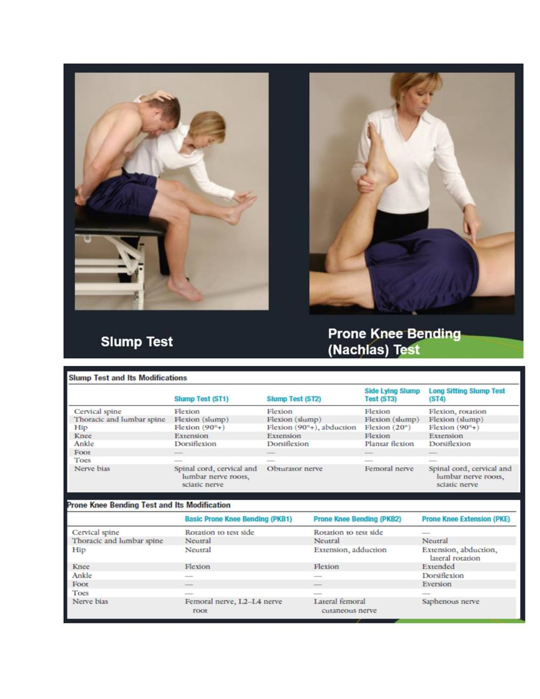

# Exercise Testing in Musculoskeletal Disease, Injury and Dysfunction

> Source: David J. Magee, *Orthopedic Physical Assessment*, 6th ed., and companion MSK assessment material. Paper 3 compilation.

## EXERCISE TESTING IN MUSCULOSKELETAL DISEASE, INJURY AND

## DYSFUNCTION

• Test for Cervical Spine • Distraction Test • The distraction test is used for patients who have complained of radicular symptoms in the history and show radicular signs during the examination. • It is used to alleviate symptoms. • To perform the distraction test, the examiner places one hand under the patient's chin and the other hand around the occiput, • then slowly lifts the patient's head • In effect, applying traction to the cervical spine.

The test is classified as positive if the pain is relieved or decreased when the head is lifted or distracted, indicating pressure on nerve roots that has been relieved • Foraminal Compression (Spurling's) Test • This test is performed if, in the history, the patient has complained of nerve root symptoms, which at the time of examination are diminished or absent. • This test is designed to provoke symptoms. • The patient bends or side flexes the head to the unaffected side first, followed by the affected side. • The examiner carefully presses straight down on the head. • Bradley and colleagues advocate doing this test in three stages, each of which is increasingly provocative; if symptoms are produced, one does not proceed to the next stage.

• The first stage involves compression with the head in neutral. • The second stage involves compression with the head in extension, and the final stage is with the head in extension and rotation to the unaffected side, then to the side of complaint with compression. • The third part of the test more closely follows the test as described by Spurling. • A test result is classified as positive if pain radiates into the arm toward which the head is side flexed during compression; this indicates pressure on a nerve root (cervical radiculitis). • Jackson's Compression Test • This test is also a modification of the foraminal compression test. • The patient rotates the head to one side. The examiner then carefully presses straight down on the head .

• The test is repeated with the head rotated to the other side. • The test is positive if pain radiates into the arm, indicating pressure on a nerve root. • The pain distribution (dermatome) can give some indication of which nerve root is affected.

• Upper Limb Neurodynamic (Tension) Tests (Brachial Plexus Tension or Elvey Test). • The upper limb neurodynamic tests (ULNT) are equivalent to the straight leg raising (SLR) test in the lumbar spine. • They are tension tests designed to put stress on the neurological structures of the upper limb by stretching them. • The neurological tissue is differentiated by what is defined as sensitizing tests (e.g., neck flexion with the SLR test). • This test, first described by Elvey, has since been divided into four tests. • Modification of the position of the shoulder, elbow, forearm, wrist, and fingers places greater stress on specific nerves (nerve bias).

• Shoulder • Apprehension (Crank) Test for Anterior Shoulder Dislocation • This test is primarily designed to check for traumatic instability problems causing gross or anatomical instability of the shoulder, although the relocation portion of the test is sometimes used to differentiate between instability and impingement. • The examiner abducts the arm to 90° and laterally rotates the patient's shoulder slowly. • By placing a hand under the glenohumeral joint to act as a fulcrum, the apprehension test becomes the fulcrum test. • Jerk Test • The patient sits with the arm medially rotated and forward flexed to 90°. • The examiner grasps the patient's elbow and axially loads the humerus in a proximal direction. • While maintaining the axial loading, the examiner moves the arm horizontally (cross flexion/ horizontal adduction) across the body . • A positive test for recurrent posterior instability is the production of a sudden jerk or clunk as the humeral head slides off (subluxes) the back of the glenoid. • When the arm is returned to the original 90° abduction position, a second jerk may be felt as the head reduces. • Kim, et al.208 reported that the positive signs also indicate a positive test for a posteroinferior labral tear.

• Test for Inferior Shoulder Instability (Sulcus Sign) • The patient stands with the arm by the side and shoulder muscles relaxed. • The examiner grasps the patient's forearm below the elbow and pulls the arm distally . • The presence of a sulcus sign may indicate inferior instability or glenohumeral laxity but should only be considered positive for instability if the patient is symptomatic • Hawkins-Kennedy Impingement Test • The patient stands while the examiner forward flexes the arm to 90° and then forcibly medially rotates the shoulder. • This movement pushes the supraspinatus tendon against the anterior surface228 of the coracoacromial ligament and coracoid process.

• The test may also be performed in different degrees of forward flexion (vertically "circling the shoulder") or horizontal adduction (horizontally "circling the shoulder"). • Pain indicates a positive test for supraspinatus paratenonitis/tendinosis or secondary impingement • Forearm, Wrist, and Hand • Ulnomeniscotriquetral Dorsal Glide Test • The patient sits or stands with the arm pronated. • The examiner places a thumb over the ulna dorsally and places the proximal interphalangeal joint of the index finger of the same hand over the pisotriquetral complex anteriorly. • While stabilizing the ulna, the examiner applies a posteriorly directed force through the pisotriquetral complex stressing the TFCC .

• Excessive laxity or pain when the posteriorly directed force is applied indicates a positive test for TFCC pathology.

## Watson (Scaphoid Shift) Test

• The patient sits with the elbow resting on the table and forearm pronated. The examiner faces the patient. With one hand, the examiner takes the patient's wrist into full ulnar deviation and slight extension while holding the metacarpals. • The examiner presses the thumb of the other hand against the distal pole of the scaphoid on the palmar side to prevent it from moving toward the palm while the fingers provide a counter pressure on the dorsum of the forearm. • With the first hand, the examiner radially deviates and slightly flexes the patient's hand while maintaining pressure on the scaphoid. • This creates a subluxation stress if the scaphoid is unstable. If the scaphoid (and lunate) are unstable, the dorsal pole of the scaphoid subluxes or "shifts" over the dorsal rim of the radius and the patient complains of pain, indicating a positive test. • Carpal Compression Test • The examiner holds the supinated wrist in both hands and applies direct, even pressure over the median nerve in the carpal tunnel for up to 30 seconds. • Production of the patient's symptoms is considered to be a positive test for carpal tunnel syndrome.

## FOR LUMBAR SPINE

• Slump Test • The slump test has become the most common neurological test for the lower limb. The patient is seated on the edge of the examining table with the legs supported, the hips in neutral position (i.e., no rotation, abduction, or adduction), and the hands behind the back. • The examination is performed in sequential steps. First, the patient is asked to "slump" the back into thoracic and lumbar flexion. • The examiner maintains the patient's chin in the neutral position to prevent neck and head flexion. The examiner then uses one arm to apply overpressure across the shoulders to maintain flexion of the thoracic and lumbar spines.

• While this position is held, the patient is asked to actively flex the cervical spine and head as far as possible (i.e., chin to chest). • The examiner then applies overpressure to maintain flexion of all three parts of the spine (cervical, thoracic, and lumbar) using the hand of the same arm to maintain overpressure in the cervical spine. • With the other hand, the examiner then holds the patient's foot in maximum dorsiflexion. • While the examiner holds these positions, the patient is asked to actively straighten the knee as much as possible. • The test is repeated with the other leg and then with both legs at the same time.

If the patient is unable to fully extend the knee because of pain, the examiner releases the overpressure to the cervical spine and the patient. • Prone Knee Bending (Nachlas) Test • The patient lies prone while the examiner passively flexes the knee as far as possible so that the patient's heel rests against the buttock. • At the same time, the examiner should ensure that the patient's hip is not rotated. • If the examiner is unable to flex the patient's knee past 90° because of a pathological condition in the knee, the test may be performed by passive extension of the hip while the knee is flexed as much as possible.

• Unilateral neurological pain in the lumbar area, buttock, posterior thigh or sometimes the anterior thigh may indicate an L2 or L3 nerve root lesion

## Straight Leg Raising Test

• Also known as Lasègue's test, the straight leg raising test is done with the patient completely relaxed. • It is one of the most common neurological tests of the lower limb. • It is a passive test, and each leg is tested individually with the normal leg being tested first. • With the patient in the supine position, the hip medially rotated and adducted and the knee extended, the examiner flexes the hip until the patient complains of pain or tightness in the back or back of the leg. • If the pain is primarily back pain, it is more likely a disc herniation from pressure on the anterior theca of the spinal cord,198 or the pathology causing the pressure is more central. • "Back pain only" patients who have a disc prolapse have smaller, more central prolapses. • If pain is primarily in the leg, it is more likely that the pathology causing the pressure on neurological tissues is more lateral.

## Passive Lumbar Extension Test

• The patient lies prone and relaxed. The examiner passively lifts and extends both extremities at the same time to about 1 foot (30 cm) from the bed. • While maintaining the extension, the examiner gently pulls the legs. • The test is considered positive if, in the extended position, the patient complains of strong pain in the lumbar region, very heavy feeling in the low back, or it feels like the low back is "coming off" and the pain disappears when the legs are lowered to the start position. • Numbness or prickling sensation are not positive signs.

## FOR HIP

• Patrick's Test (FABER or Figure-4 Test) • The patient lies supine, and the examiner places the patient's test leg so that the foot of the test leg is on top of the knee of the opposite leg . • The examiner then slowly lowers the knee of the test leg toward the examining table. • A negative test is indicated by the test leg's knee falling to the table or at least being parallel with the opposite leg. • A positive test is indicated by the test leg's knee remaining above the opposite straight leg. • If positive, the test indicates that the hip joint may be affected, that there may be iliopsoas spasm, or that the sacroiliac joint may be affected. • Flexion, abduction, and external rotation (FABER) is the position of the hip at which the patient begins the test. The test is sometimes referred to as Jansen's test. • Anterior Labral Tear Test • This test, also called the anterior apprehension test,127 is used to test for anterior-superior impingement syndrome, anterior labial tear, and iliopsoas tendinitis.

• The patient is placed in supine position. • The examiner takes the hip into full flexion, lateral rotation, and full abduction as a starting position. • The examiner then extends the hip combined with medial rotation and adduction . • A positive test is indicated by the production of pain, the reproduction of the patient's symptoms with or • Ortolani's Sign • Ortolani's test can determine whether an infant has a CDH. • With the infant supine, the examiner flexes the hips and grasps the legs so that the examiner's thumbs are against the insides of the knees and thighs, and the fingers are placed along the outsides of the thighs to the buttocks. • With gentle traction, the thighs are abducted and pressure is applied against the greater trochanters of the femora

## For Knee

• Apley's Test • The patient lies in the prone position with the knee flexed to 90°. The patient's thigh is • then anchored to the examining table with the examiner's knee. • The examiner medially and laterally rotates the tibia, combined first with distraction, while noting any restriction, excessive movement, or discomfort. • Then the process is repeated using compression instead of distraction. If rotation plus distraction is more painful or shows increased rotation relative to the normal side, the lesion is probably ligamentous.

## Ege's Test

• This test has been described as a weightbearing McMurray's Test. • The patient stands with the knees in extension and the feet 30 to 40 cm (11 to 15 inches) away from each other. • To test the medial meniscus, the patient laterally rotates each tibia maximally and squats causing the distance between the knees and lateral rotation to increase. • The patient then stands slowly while leaving the feet laterally rotated

## McMurray Test

• The McMurray test is the grandfather of meniscus tests of the knee. However, the reliability and sensitivity of the test has been found to be low. • The patient lies in the supine position with the knee completely flexed (the heel to the buttock). • The examiner then medially rotates the tibia and extends the knee. • If there is a loose fragment of the lateral meniscus, this action causes a snap or click that is often accompanied by pain. Patellar Tap Test ("Ballotable Patella"). • With the patient's knee extended or flexed to discomfort, the examiner applies a slight tap or pressure over the patella. • When this is done, a floating of the patella should be felt. • This is sometimes called the "dancing patella" sign. Lower Leg, Ankle, and Foot • Anterior Drawer Test of the Ankle. This test is designed primarily to test for injuries to the anterior talofibular ligament, the most frequently injured ligament in the ankle. • The patient lies supine with the foot relaxed. • The examiner stabilizes the tibia and fibula, holds the patient's foot in 20° of plantar flexion, and draws the talus forward in the ankle mortise.

## External (Lateral) Rotation Stress Test (Kleiger Test)

• The patient is seated with the leg hanging over the examining table with the knee at 90°. • The examiner stabilizes the leg with one hand. • With the other hand, the examiner holds the foot in plantigrade (90°) and applies a passive lateral rotation stress to the foot and ankle. • The test is positive for a syndesmosis ("high ankle") injury if pain is produced over the anterior or posterior tibiofibular ligaments and the interosseous membrane. • If the patient has pain medially and the examiner feels the talus displace from the medial malleolus, it may indicate a tear of the deltoid ligament.

## Prone Anterior Drawer Test

• The patient lies prone with the feet extending over the end of the examining table. • With one hand, the examiner pushes the heel steadily forward. • Excessive anterior movement and a sucking in of the skin on both sides of the Achilles tendon indicate a positive sign.

## Source pages (figures, tables & slides)

These pages of the original document carry no extractable text (presentation slides, figures, tables or handwritten notes) and are reproduced as images so no source content is lost.

