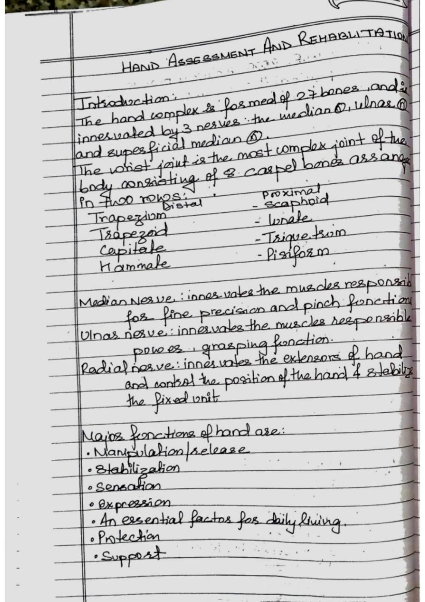
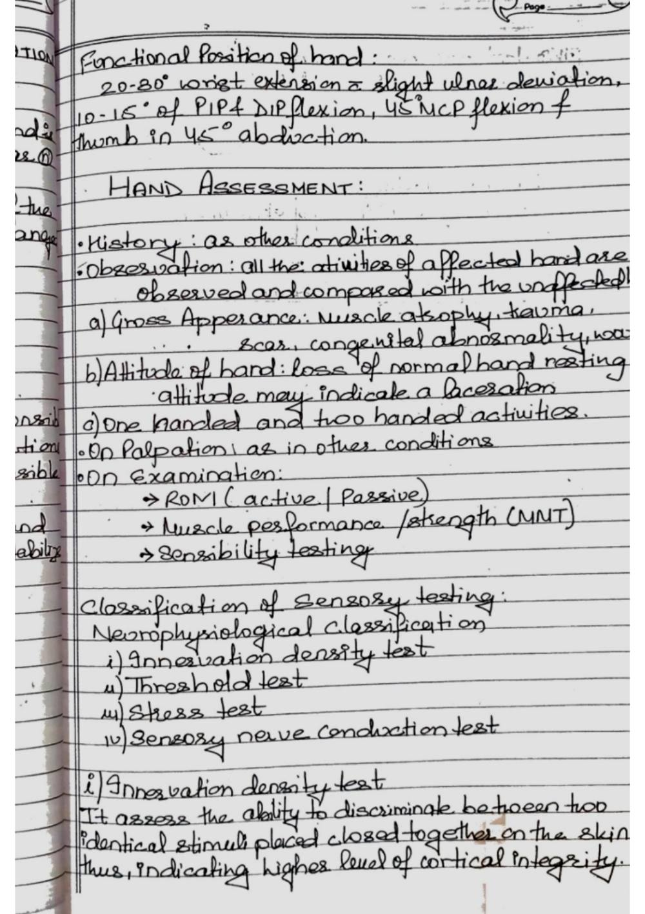
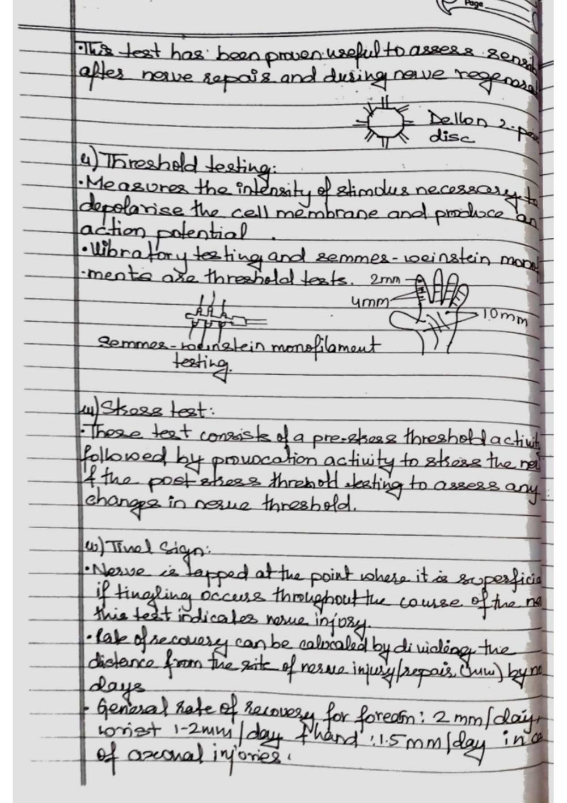
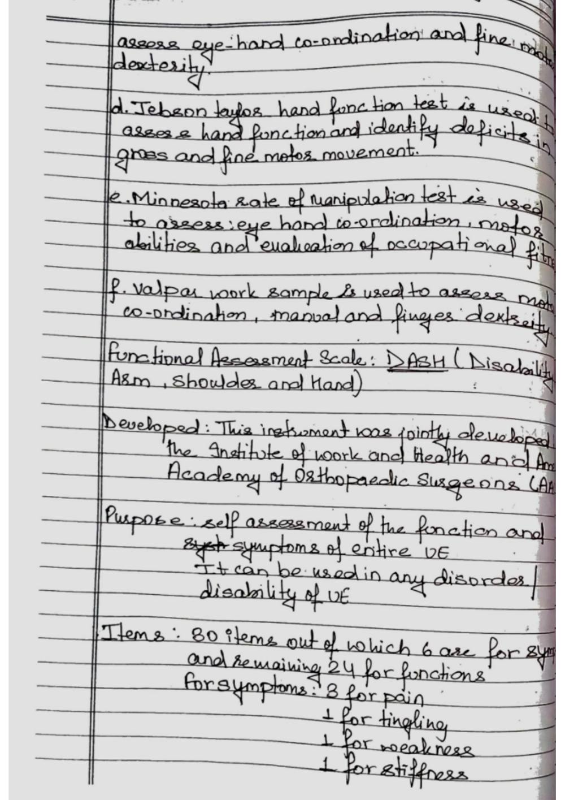
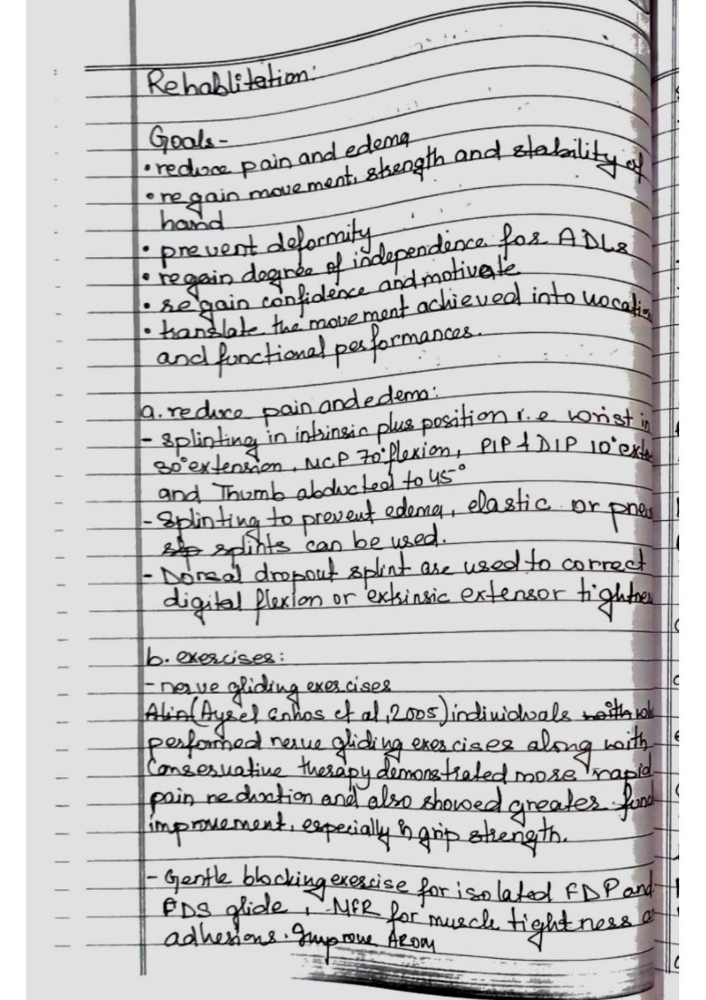
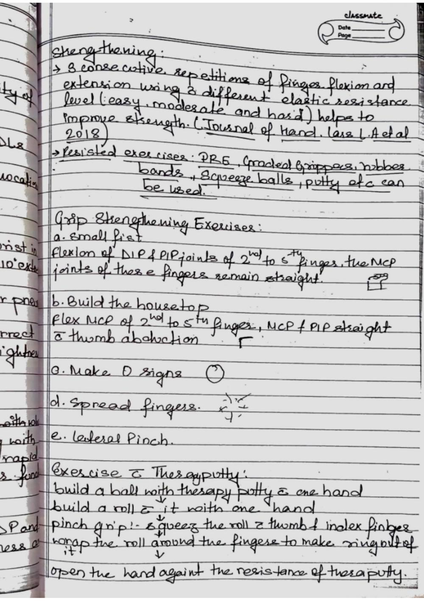
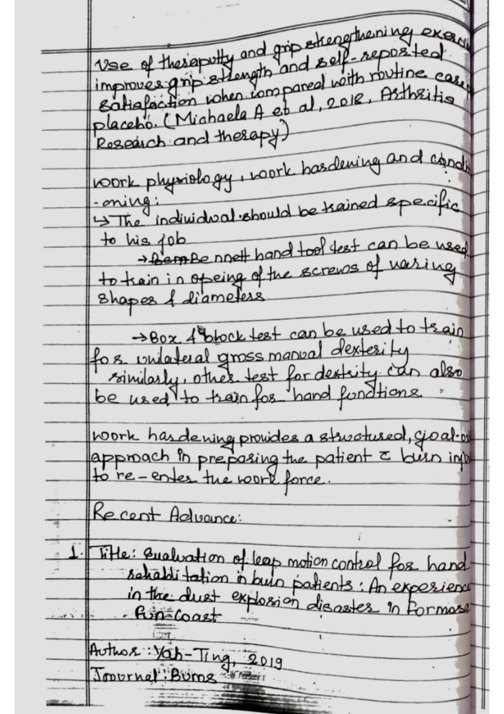
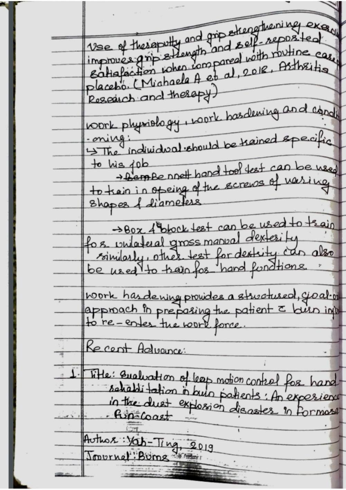

# Prescription Guidelines and Orthotic Fabrication

> Source: David J. Magee, *Orthopedic Physical Assessment*, 6th ed., and companion MSK assessment material. Paper 3 compilation.

## PRESCRIPTION GUIDELINES

ity to bony prominences make it a desirable interface for the insensate foot. See Hertzman22 for a complete review of the use The formulation of a prescription for an orthosis or prosthe- of Plastazote in lower limb orthotics and prosthetics. sis greatly influences the potential functional outcome for the Closed-cell foams are also made with synthetic rubber patient. It is critical that rehabilitation objectives and design or polychloroprene. Neoprene is available in various densi- criteria be carefully considered.

Physicians, therapists, ortho- ties, making the low-durometer versions suitable as liners for tists, and prosthetists who are involved in developing a pre- orthoses, whereas the firmer materials are used for posts or scription for an orthotic or prosthetic device must have a soling for shoes. Spenco (Spenco Medical Corp., Waco, Texas) sound understanding of orthotics and prosthetics to be suc- is a microcellular neoprene foam that reduces shear forces to cessful in effectively treating patients with these devices.

the foot's plantar surface and the occurrence of foot blisters Assessment of functional deficit includes a thorough evalu- in athletes.26 The nylon (polyamide)-covered neoprene acts ation of the patient's present physical status, including muscle as a shock absorber while also reducing friction on the foot's strength testing, range of motion measures, and documenta- plantar surface.21 Although few of these materials are heat tion of other physical impairments that would affect the fit or moldable, most can be conformed without difficulty to the performance of the device. Equally important to the physical shallow contours of foot orthoses.

Lynco (Apex Foot Health examination is the consideration of any individual needs of Industries, Teaneck, N.J.) is an open-cell neoprene foam that the patient and an understanding of how the treatment will dissipates heat more efficiently than its closed-cell cousin; affect daily activities. To increase the success of treatment, the however, it does not attenuate shock as well as Spenco.21 patient and other rehabilitation team members must reach a Polyurethane open-cell foams are alternatives for top cov- consensus on the type of device and the associated training ers for foot orthoses. They provide good shock absorption and and education required for optimal functional outcome. dissipate heat well.

Some of the commercially available open- cell polyurethane foams include Poron (Rogers Corporation, Orthotic Prescription Rogers, Conn.), PPT (Professional Protective Technology, Deer The Committee on Prosthetics and Orthotics of the American Park, N.Y.), and Vylite (Steins Foot Specialties, Newark, N.J.). Academy of Orthopaedic Surgeons developed a technical Several studies that compare materials used to fabricate analysis form to standardize the process of patient evalua- orthoses have been conducted.27-33 In 1982, Campbell and tion.

This evaluation protocol documents the biomechani- colleagues27 conducted compression tests on 31 materials to cal deficits of the patient and provides the basic information determine their suitability for insoles in shoes. Materials were needed for orthotic prescription formulation. This systematic classified according to stiffness into the categories "very stiff," approach has two major objectives: to define the anatomical "moderately deformable," and "highly deformable." The mod- segments that the orthosis will encompass and to accurately erately deformable group of plastics, which included 19 of the describe the biomechanical controls needed for treatment.

tested foamed plastics, was deemed the most beneficial as an The underlying principle of this assessment is that orthoses insole material. Campbell and colleagues27 concluded that should be designed to control only those movements consid- these materials could relieve stress from bony prominences ered abnormal while permitting free motion in anatomical and transfer the loads to the adjacent soft tissues more effec- segments that are not impaired. tively than could the very stiff or highly deformable materials. Technical analysis forms were developed for three general Studies evaluating shoe insole materials also report them to be regions of the body: the upper limb, lower limb, and spine.

The effective at attenuating shock during walking in various ways.33 forms are four pages long with the same basic approach for for- mulating an orthotic prescription. The first page has sections Viscoelastic Polymers for recording general patient information and noting major A viscoelastic solid is a material that possesses the characteris- physical impairments (Figure 6-1). The major impairment tics of stress relaxation and creep. Stress relaxation occurs when section characterizes any functional limitations, such as skel- a material that is subjected to a constant deformation requires etal structure, sensation, or joint contracture.

This informa- a decreasing load with time to maintain a steady state.34 Creep tion provides an overview of the patient's clinical presentation. refers to the increase in deformation with time to a steady The second and third pages of the technical analysis form state as a constant load is applied.34 Sorbothane (Sorbothane, (Figure 6-2) contain diagrams of the respective anatomical Inc., Kent, Ohio), widely used as an insole m ­ aterial, is made (limb or trunk) segments for which an orthotic p ­ rescription is 150 Section I Building Baseline Knowledge

Technical Analysis Form Lower Limb Revised March 1973

## Name No. Age Sex

Date of onset Cause

Occupation Present lower-limb equipment

## Diagnosis

## Ambulatory Nonambulatory

Major impairments:

## A. Skeletal

1. Bone and joints: Normal Abnormal 2. Ligaments: Normal Abnormal Knee: AC PC MC LC

## Ankle: MC LC

3. Extremity shortening: None Left Right Amount of discrepancy: ASIS-Heel ASIS-MTP MTP-Heel

## B. Sensation: Normal Abnormal

1. Anesthesia Hypesthesia Location: Protective sensation: Retained Lost 2. Pain Location:

C. Skin: Normal Abnormal:

## D. Vascular: Normal Abnormal Right Left

E. Balance: Normal Impaired Support:

F. Gait deviations:

G. Other impairments:

## Legend

= Direction of translatory Volitional force (V) Proprioception (P) motion N = Normal N = Normal

## G = Good I = Impaired

## F = Fair A = Absent

## P = Poor

= Abnormal degree of T = Trace rotary motion Z = Zero D = Local distension or 60° enlargement

= Fixed position Hypertonic muscle (H) 30° = Pseudarthrosis

## N = Normal

1 cm. M = Mild

## Mo = Moderate

= Fracture S = Severe = Absence of segment

FIGURE 6-1 The technical analysis form provides a systematic method of data collection for the development of prescriptions for lower extremity orthoses. The first page of the form is used to record the patient's history and current impairments. AC, Anterior cruciate ligament; ASIS, anterior supe- rior iliac spine; LC, lateral collateral ligament; MC, medial collateral ligament; MTP, medial tibial pla- teau; PC, posterior cruciate ligament. (From Committee on Prosthetics Research and Development. Report of the Seventh Workshop Panel on Lower Extremity Orthoses of the Subcommittee on Design and Development. Washington, DC: National Research Council-National Academy of Sciences, 1970; and McCollough NC III. Biomechanical analysis systems for orthotic prescription. In American Academy of Orthopaedic Surgeons, Atlas of Orthotics: Biomechanical Principles and Application, 2nd ed. St. Louis: Mosby, 1985. pp. 35-75.)

## Sagittal Coronal Transverse

## Anterior Posterior Medial Lateral Medial Lateral

## V H V H

V V V

## H H H

Hip P

## Femur

## Upper

V V

## Middle

H H

## Lower P

## Knee

## Tibia

V V V

## Upper

## H H H

## Middle

## Lower

## Ankle P

## Subtalar

## Left

FIGURE 6-2 Subsequent pages of the technical analysis form are used to detail characteristics of each limb or body segment for which the orthosis or prosthesis will be made. Information recorded on these pages includes existing deformity, proprioceptive capacity (P), restriction or hypermobility of joint rotary and translatory range of motion in all three planes of movement, volitional strength (V), and the level of hyperto- nicity (H). (From Committee on Prosthetics Research and Development. Report of the Seventh Workshop Panel on Lower Extremity Orthoses of the Subcommittee on Design and Development. Washington, DC: National Research Council-National Academy of Sciences, 1970; and McCollough NC III. Biomechanical analysis systems for orthotic prescription. In American Academy of Orthopaedic Surgeons, Atlas of Orthotics: Biomechanical Principles and Application, 2nd ed. St. Louis: Mosby, 1985. pp. 35-75.) 152 Section I Building Baseline Knowledge

being considered. Each skeletal region is represented in three Although an in-depth biomechanical assessment may not planes of motion: coronal, sagittal, and transverse. On either always be necessary, a system based on these principles is a side of the figures, square boxes at the level of the joints are logical and objective method for formulating an orthotic used to note volitional force, hypertonicity, proprioception, prescription. and range of motion. The fourth page consists of a summary of the functional disability, treatment objectives, orthotic rec- Prosthetic Prescription ommendation, and a key for the biomechanical controls of The formulation of a prosthetic prescription requires a dif- function. ferent evaluative process.

Prosthetic prescription depends on Voluntary movements of muscles are assessed by con- an in-depth understanding of components and materials as ventional muscle testing techniques. Muscle strength can well as their indications and contraindications for use. Ideally, be recorded with either the standard descriptive or numeric prosthetic prescription begins before amputation surgery, so muscle grading systems, depending on regional preferences. the residual limb is of appropriate length and healing is ade- Two types of joint (limb) motion are recorded on the forms: quate for optimal prosthetic use. Factors such as vascular sup- rotary and translatory.

According to McCollough,36 all points ply, anticipated activity level, intelligence, vocation, and age of the distal segment move in the same direction, following are also important to consider. Range of motion, flexible and the same path shape and distance during translatory motion. fixed contracture, functional strength, skin condition, girth During rotary motion, one point of the distal segment (or its measurements, pain, and sensation of the residual limb and imaginary extension) remains fixed while other points move the intact limb are evaluated. in an arc around it. Translatory motion is recorded with linear An important part of prosthetic prescription is component arrows in the direction of the distal segment's movement rela- selection.

The diversity of prosthetic foot-ankle units and tive to its proximal counterpart. The linear arrows are placed knee mechanisms for lower extremity prosthetics, and the below the circle (representing the joint axis) for translatory variety of terminal devices for the upper extremity, can pres- motion. If translatory force acts in the vertical axis, the lin- ent difficult decisions for those who are unfamiliar with their ear arrow is placed to the side of the circle. Rotary motion intended application.

Therefore, prosthetists are often relied and the related degree of range of motion are documented on for recommendations on components because they are by an arrow within a protractor-type arrangement for each usually most familiar with the specifications and limitations. joint. The established normal range of motion for each joint Many prosthetic teams have developed data collection forms is shaded on the form for comparative reference. If a fixed to standardize the prosthetic prescription process. Redhead37 contracture or fusion of the joint is present, a double linear suggests that the prescription for a prosthesis consider each arrow is used.

of the major "prescription options." Examples of the specifi- Hypertonicity of muscle groups in each of the body seg- cations delineated by Redhead for a transfemoral prosthesis ments is described by a functionally based letter scale.36 A des- are type of limb, socket material and design, suspension, knee ignation of mild tonicity is given when any hypertonus that is joints, knee controls, ankle joints, feet, and cosmesis. present is thought to be functionally insignificant. Moderate tonicity indicates that tone might have some functional value,

## FABRICATION PROCESS

such as assisting the patient in holding an item during minor tasks. A designation of severe tonicity indicates that normal Once a prescription for a custom orthosis or prosthesis has function is not possible. The patient's proprioceptive ability is been created, the fabrication process begins. The traditional described in a similar way, as absent, impaired, or normal for fabrication process is composed of six steps: each of the body segments of interest.

Step 1: Taking accurate measurements of the limb The final page of the technical analysis form (Figure 6-3) Step 2: Making a negative impression (cast) contains space for an overview of functional impairments, a Step 3: Creating a three-dimensional positive model of the limb checklist of the orthotic treatment objectives, and a chart that or body segment details the orthotic recommendation. The desired orthotic Step 4: Modifying the positive model to incorporate the desired control for each body segment is indicated by a specific letter; controls as many as seven types of orthotic controls can be incorpo- Step 5: Fabricating the orthosis or prosthetic socket around the rated into the design of an orthosis.

The terms and descrip- positive model tions of these controls are indicated in the key. If the orthotic Step 6: Fitting of the device to the patient recommendation section is completed correctly, the chart will In some instances, further modification or adjustment is indicate the body segments that the device will encompass and necessary to achieve optimal fit and function of the device. the desired biomechanical control of function needed. Any comments on the specific design requirements or materials, Measurement or both, can be detailed in the remarks section of the form. Measurements are most often referenced from readily pal- For the orthotist, the prescription is the blueprint from pable bony landmarks.

Important measurements include which the design of a device is based. It specifies the force sys- the length, successive circumferences, and mediolateral and tem requirements needed to achieve the treatment ­objectives anteroposterior dimensions of the body segment for which independent of material selection or production processes. the orthotic or prosthetic device is being created. Although

## SOFT TISSUE REPAIR ASSESSMENT

1. Subjective Assessment: History Taking: - Obtain a comprehensive medical history, including any pre-existing conditions, previous injuries, surgeries, and allergies. - Ask about the patient's occupation, hobbies, and sports activities to understand the demands on their soft tissues. Mechanism of Injury: - Gather specific details about how the injury occurred, including the direction of force, position of the body, and any twisting or impact. - Identify whether the injury is acute (recent) or chronic (long-standing). Pain Assessment: - Use pain scales (e.g., Visual Analog Scale) to quantify the intensity of pain. - Determine the quality of pain (sharp, dull, throbbing) and its duration (constant, intermittent).

Functional Limitations: - Understand how the injury is impacting the patient's ability to perform daily tasks, work duties, and recreational activities. - Identify any specific functional goals the patient wants to achieve. 2. Objective Assessment: Observation: - Observe the patient's posture, alignment, and any visible abnormalities in the injured area. - Look for signs of swelling, discoloration, muscle atrophy, or scars. Palpation: - Palpate the injured area gently to identify areas of tenderness, swelling, muscle tension, and changes in tissue texture. - Compare findings with the non-injured side for reference. Range of Motion (ROM): - Assess active and passive range of motion of the affected joint(s) to determine any restrictions.

- Note any pain, muscle guarding, or apprehension during movement. Strength Testing: - Evaluate muscle strength around the injured area using manual resistance or handheld dynamometry. - Compare strength on the injured side to the non-injured side. Special Tests: - Perform specific orthopedic tests to assess ligament stability, joint integrity, muscle length, and nerve function. - Examples include Lachman test for ACL integrity, McMurray test for meniscal injuries, and Phalen's test for carpal tunnel syndrome. Functional Testing: - Assess the patient's ability to perform functional tasks relevant to their daily life or sport. - Observe for compensatory movements, pain responses, and limitations in functional movements. 3.

Assessment of Healing Progression: Inflammation Phase: - Evaluate the extent of swelling, redness, warmth, and pain in the initial stages of healing. - Monitor the patient's response to interventions aimed at reducing inflammation (rest, ice, compression, elevation). Proliferation and Remodeling Phases: - Track changes in tissue texture, pliability, and pain levels as healing progresses. - Observe the formation and quality of scar tissue. 4. Communication and Education: Patient Education: - Explain the different stages of soft tissue healing and what the patient can expect during each phase. - Provide guidance on proper body mechanics, activity modifications, and home exercises.

Collaboration: - Communicate with other healthcare professionals, such as orthopedic surgeons or referring physicians, to ensure a coordinated approach to assessment and treatment. 5. Documentation Accurate and detailed documentation of your assessment findings, interventions, and progress is essential for tracking the patient's healing journey and informing your treatment decisions.

Remember that soft tissue assessment is a dynamic process that evolves as the patient progresses through different phases of healing. As a physiotherapist, your expertise in assessing soft tissue repair will guide your treatment plan to facilitate optimal recovery and functional restoration for your patients.

## Source pages (figures, tables & slides)

These pages of the original document carry no extractable text (presentation slides, figures, tables or handwritten notes) and are reproduced as images so no source content is lost.

