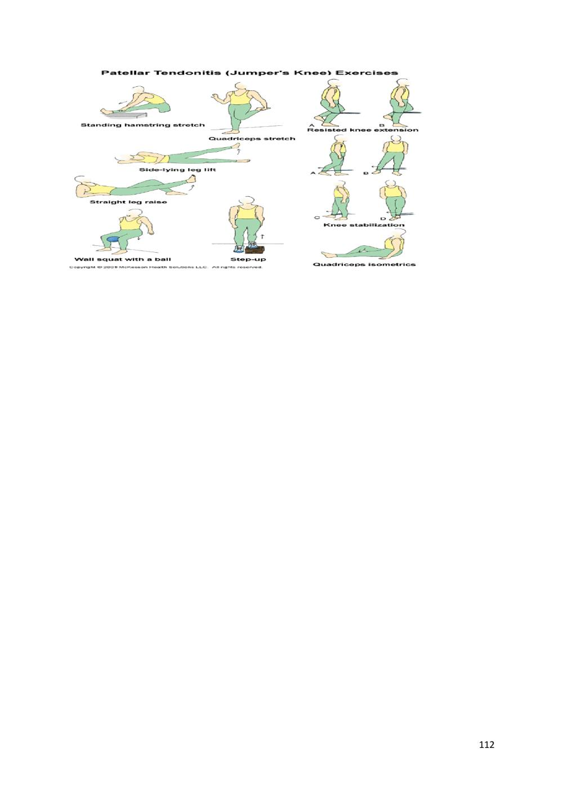
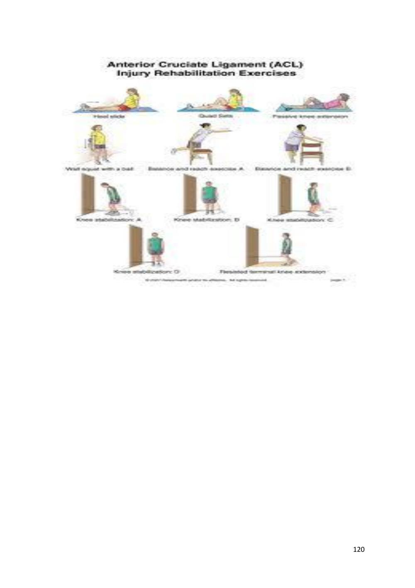
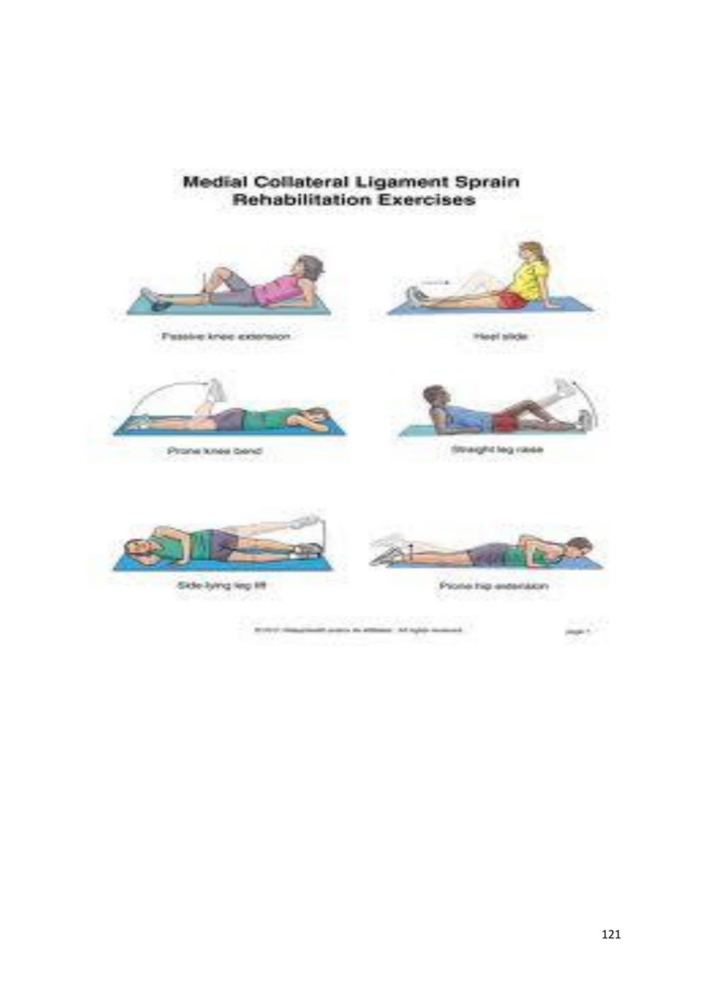
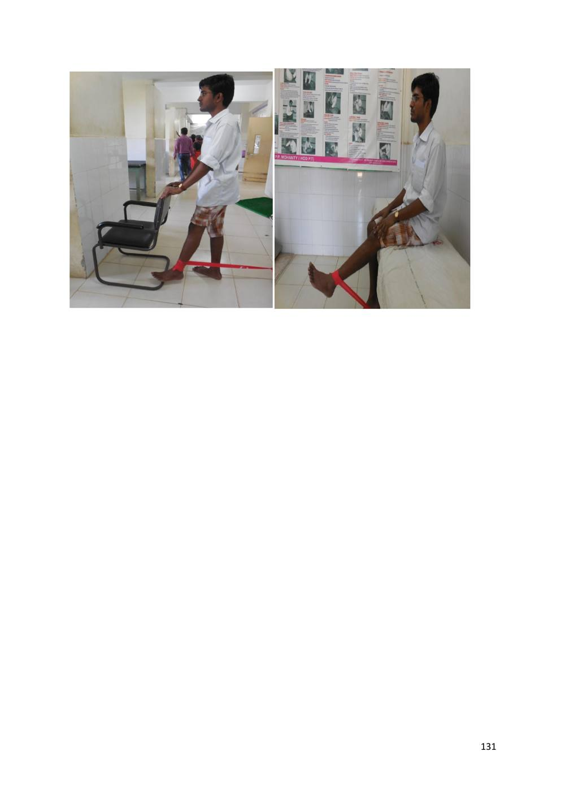

# Soft Tissue Injury and Repair

> Source: David J. Magee, *Orthopedic Physical Assessment*, 6th ed., and companion MSK assessment material. Paper 3 compilation.

## REFERENCE

"Therapeutic Modalities for Musculoskeletal Injuries" by Craig R. Denegar, Ethan Saliba, and Susan L. Sigward:

Orthopedic Physical Assessment" by David J. Magee:

## SOFT TISSUE INJURY

## MAMTA MASNJARI SAHU, SENIOR PHYSIOTHERAPIST CUM JUNIOR LECTURER

Soft tissue injury may include injury to tendons, ligaments, capsules, synovium, articular cartilage and fascias.

## TENDON INJURIES

Muscles are attached firmly to bone and connective tissue at one end and generally insert in bones via tendons. Tendons are white fibrous cords that are lined with a loose tissue (paratenon) and which sometimes run through a fibrous tube (tendon sheath). Tendons have the ability to glide over bone and through tissues. Muscle contraction is therefore transmitted via the tendons causing intervening joints to move. Muscles that bend the joint are termed "flexor" and those that straighten the joint, "extensors".

As a general, tendon injury can be classified as: -

1. Acute (mostly traumatic in nature) -also known as strain

2. Chronic (because of overuse, postural or occupational cause)

Different terms are used to describe a chronic tendon injury: -

1. Tendinitis. This actually means "inflammation of the tendon.

2. Tendinosis. This refers to tiny tears in the tissue in and around the tendon caused by overuse.

Acute injury

Cause is overloading. As body has got its own defence mechanism, during overloading eccentric contraction of muscle occurs which absorbs some load and prevents excessive damage to the structures. So if the overloading occurs in a position where the muscle is in no contraction state or in concentric contraction state, it causes injury to the structure.

## Pathology

Injury leads to bleeding. Gradually clot formation occurs to fill the gap. Inflammation occurs as a response to injury to the tissues which heals with fibrosis.

## MUSCLE STRAIN

Muscle pull or even a muscle tear -- implies damage to a muscle or its attaching tendons. You can put undue pressure on muscles during the course of normal daily activities, with sudden heavy lifting, during sports, or while performing work tasks.

90 Muscle damage can be in the form of tearing (part or all) of the muscle fibers and the tendons attached to the muscle. The tearing of the muscle can also damage small blood vessels, causing local bleeding (bruising) and pain (caused by irritation of the nerve endings in the area).

Definition: - Strain is the injury to the musculotendinous unit

## Site:-

- Muscle Belly

- Musculotendinous Junction

- Tendon

- Teno periosteal Junction

## Pathogenesis: -

Since muscle is a highly elastic tissue injury to muscle belly is relatively rare. Usually injury occurs to the tendon. Muscle injury occurs due to direct blow which is referred as contusion. Depending on the severity of injury, movement and function are going to be impaired. Both active movement and passive stretching will be painful and limited. Healing occurs by fibrosis & adhesion. Adhesion occurs within the muscle belly so that movement will be impaired. Adhesion may occur to the underlying structure affecting active as well as passive range of motion.

## Types

## Grade 1

 A Few Fibres Damaged

 Localized Swelling

 Pain

 Tenderness

 Resisted Isometric Contraction Is Painful But Strong

 Passive Movement Could Be Painful At End Range

 Function Is Not Impaired. Patient May Complain Of Pain During Some Activities That Involves Action Or The Involved Muscle.

## Grade II

91  More Number Of Fibres Damaged But Not All

 More Swelling, Pain

 Tenderness

 Loss Of Function

 Resisted Isometric Contraction Is Painful And Weak

 Passive Stretching Painful & Limited.

## Grade III

 Complete Rupture

 All Fibres Are Damaged

 Following Rupture Muscle Retracts Proximally Due To Spasm To A Visible Or Palpable Gap Maybe Found.

 The Contour Is Dissolved I. E. Unusual Ball Like Swelling Over The Muscle Belly Due To Proximal Retraction Of Contractile Tissue.

 Resisted Isometric Contraction Is Painless & weak

 Active Movement May Be Impaired

 Passive Stretching Produce No Pain

 Rom Is Full

Clinical test

1.Thompson test

Squeeze the muscle belly. Movement on distal part indicate continuity of muscle.when there is no movement - Thompson test is positive and suggestive of complete rupture.

2.FG test

Faradic stimulation can be used to differentiate between complete rupture or neuromuscular deficit.

Role of physiotherapy

1) Immediately to stop bleeding and allow haematoma to form.

2) Prevent further damage.

Rx - rest to the part (functional rest)

92 3) Early resolution of oedema

Rx - ice ( 5 - 6 times a day ) , compression ( 15 mins ), elevation.

4) Relief of pain

Rx - for swelling, pain & accelerate healing - HVPGS/IFT/TENS

5) Promote healing

Rx - heating modalities depending upon depth of tissue involved.

For superficial tissue - hot fermementation, pwb.

For deep tissue -SWD, MWD, are used.

6) Prevent complications

Disuse atrophy due to lack of movement and weakness of muscles

Rx - static contraction of muscles

If static contraction not possible - irradiation techniqueor electrical therapy i. e. faradic stimulation/IFT

7. To prevent Scar Tissue Formation and to Promote Physiological Healing

Scar tissue formation - adhesion - shortening-limited JROM

Optimal stress to be applied to help in realignment of collagen tissue perpendicular to the stress so that length will be restored

As healing tissue is subjected to progressive stress, strength is regained.

Optimal stress - discomfort but no pain.

If there is no discomfort, stress is less than optimal - no effect on remodelling

If stress is more as determined by pain- leads to damage of granulation tissue.

## Rx -cyriaxDTFM - Muscle, Tendon, Ligament

For ligament - Joint Play

For muscle, Tendon, Ligament - Physiological Movement.

8) Early return to activities - one must have good strength, endurance, ROM, flexibility, balance, etc...

Rx - For strength, endurance - progresive strengthening exercises (PRE by using Fowler technique with 10RM) & PNF

93 - For generalized endurance - cycling, swimming, rowing, jogging, etc...

- For ROM - mobilization

- For flexibility - stretching of soft tissues

For balance -

a) propioceptors damaged during injury causing forgetfullness of propioceptors due to prolonged immobilisation.

b) Propioception helps for reflex contraction of muscle to prevent further injury

c) Once patient can bear full weight bearing then balance board and wobble board are used for balance training.

## METHOD/TRAINING: -

• Inside parallel bar with hand support & eye open

• Inside parallel bar with hand support & eyes closed

• Eye open without hand support

• Same sequence outside parallel bar with eye closed

- Weight training

- Running program: -

- To initiate running, one should have full range of motion, without swelling & pain, muscle strength should be of 70% of normal side.

94 • Running in a straight line

• Running in a circle

• Running on a figure of 8 path

• Running with sag weight with left and right at regular intervals

## Quadricep Strain

It usually occurs during sprinting, jumping or kicking. Strains are seen in all the quadriceps muscles but are most common in rectus femoris, which is more vulnerable to strain as it passes over two joints: the hip and the knee. The most common site of strain is the distal musculotendinousjunction of the rectus femoris.

Like all muscles strains, quadriceps strain may be graded into mild (Grade 1), moderate (Grade 2) or severe, complete tears ( Grade 3). The athlete feels the injury as a sudden pain in the anterior thigh during an activity requiring explosive muscle contraction. There is local muscle pain and tenderness and, if the strain is severe, swelling and bruising.

The causes of Quadricep Strain

A Quadricep Strain, including ruptures, partial ruptures or strains are usually caused by a sudden twist, over-stretch or an over contraction of the muscle, such as while playing football or sprinting.

Grades of quadricep strain

## Grade 1

95 Strain is a minor injury with pain on resisted active contraction and on passive stretching. Patient feels tightness in the thigh. Unable to walk properly. Probably not much swelling. An area of local spasm is palpable at the site of pain. An athlete with such a strain may not cease activity at the time of the pain but will usually notice injury after cool down or the following day. Trying to straighten the knee against resistance probably won't produce much pain (unlike a grade 2 or 3). Healing time-2 to 10 days.

## Grade 2

Strain cause significant pain on passive stretching as well as on unopposed active contraction. Probably cannot walk properly. The athlete may notice swelling. There is usually a moderate area of inflammation surrounding a tender palpable lesion. Straightening the knee against resistance causes pain. The athlete with a grade 2 strain is generally unable to continue the activity. Healing time-10 days to 6 weeks.

## Grade 3

Strain of the rectus femoris occurs with sudden onset of pain and disability during intense activity. A muscle fibre defect is usually palpable when the muscle is contracted. Unable to walk properly without the aid of crutches.Bad swelling appearing immediately. A static contraction will be painful and might produce a bulge in the muscle. In the long term, they resolve with conservative management, often with surprisingly little disability. Healing time- 6 to 10 weeks.

Treatment of Quadricep Strain (or Tears)

## Acute Stage

## RICE

NSAIDs if not contraindicated.

Crutchs in a touch-down or partial weight bearing (painless) fashion.

Hold all lower extremity athletic participation.

Avoid SLR in early rehabilitation because of increased stress on torn rectus femoris.

Electrical stimulation, Laser if superficial and pulsed ultrasound.

Intermediate Stage (usually 3-10 days postinjury)

## Goals

Regain normal gait.

Regain normal knee and hip motion.

96 Usually intermediate stage begins 3-10 days postinjury, depending on severity of injury.

Exercises and Modalities

Initiate a gentle quadriceps and hamstring stretching program.

PNF pattrens.

Aquatic rehabilitation program in deep water with floatation belt.

Cycling with no resistance

Moist heat before stretching exercises

Begin higher dosage ultrasound (for thermal effects) and or electrical stimulation, when swelling has been controlled.

Return to Function Stage

Terminal knee extension exercises.

Increase aquatic program (deep water running).

Begin knee extension with light weights.

Myofascial tension in knee flexion.

SLR, quads sets progressing to PRE (progressive resistance exercises) with 1-5 pound weight on the ankle.

Increase low impact exercises to progress endurance and strength.

Progress bicycle resistance and intensity of workout.

Elliptical trainer.

Thera-bands for hip flexion, extension, abduction, adduction.

Walking progression on jogging (painless).

30-degrees mini squats (painless).

Initiate sports specific drills and agility training.

Isokinetic equipment (at higher speeds) with patient supine.

97 NOTE: Even quadriceps tears with palpable defects typically respond to this conservative regimen. Persistant defects are common, but rarely, if ever, require surgery or cause loss of function.

Employ preactivity quad stretching program and appropriate warm-up regimen with return to sports.

Criteria for Return to Play

Quadriceps flexibility equal bilaterally.

Asymptomatic with functional drills at full effort.

Quadricep strength 85-90% (via isokinetic testing) of contralateral quadricep.

## Quadricep Strain Prevention

Always warm up and cool down and stretch thoroughly before and after taking part in any physical or sporting activity in order to reduce the risk of injury.

Make sure you spend time strengthening the groin and thigh muscles to improve your performance and reduce the risk of injury.

Try to keep your body weight within normal limits for your height, as excessive body weight can aggravate hip pain caused by conditions like arthritis.

## Hamstring Strain

## Injuries > Thigh > Hamstring Strain

(Also known as Hamstring Tear, Strained Hamstring, Torn Hamstring Muscle, Pulled

## Hamstring)

A hamstring strain is a condition that is frequently seen in running and kicking sports and is characterised by partial or complete tearing of one or more of the hamstring muscles located at the back of the thigh (figure 1).

The muscle group at the back of your thigh is commonly called the hamstrings. The hamstrings comprises of 3 muscles:

bicepsfemoris

semimembranosus

semitendinosus

98 These muscles originate from the pelvis and insert into the top of the lower leg bones (figure 1).The hamstring muscles are responsible for bending the knee and straightening the hip during activity and are particularly active during running, jumping and kicking.

During contraction of the hamstrings, tension is placed through the hamstring muscles. When this tension is excessive due to too much repetition or high force, one or more of the hamstring muscles can tear. This is known as a hamstring strain.

Tears to the hamstring muscle can range from a small partial tear whereby there is minimal pain and minimal loss of function, to a complete rupture which may require surgical reconstruction. Hamstring strains range from a grade 1 to a grade 3 tear and are classified as follows:

Grade 1: a small number of fibres are torn resulting in some pain, but allowing full function.

Grade 2: a significant number of fibres are torn with moderate loss of function.

Grade 3: all muscle fibres are ruptured resulting in major loss of function.

The majority of hamstrings strains are grade 2 tears.

Causes of a hamstring strain

Hamstring strains commonly occur due to a sudden contraction of the hamstring muscles often when they are in a position of stretch. This sometimes occurs with rapid acceleration whilst running or when a footballer performs a long kick. They are commonly seen in running sports such as football, hockey and athletics (particularly sprinters, hurdlers, and long jumpers). Hamstring strains tend to occur more commonly in the older athlete and particularly following an inadequate warm-up.

Signs and symptoms

Patients with a hamstring strain usually feel a sudden sharp pain or pulling sensation in the back of the thigh during the provocative activity. In minor cases, the patient may be able to continue the activity only to have an increase in symptoms upon resting later (often that night or the next morning). In more severe cases, the patient may be unable to continue the activity and will often limp or be unable to walk off the playing field.

Patients with a strained hamstring usually experience an increase in pain during activities which place tension on the hamstring muscles. These activities may include: walking (especially uphill), going up and down stairs, running, jumping, kicking and performing a hamstring stretch. It is also common for patients to experience pain or stiffness after these activities with rest, especially upon waking in the morning.

Patients with this condition may also experience swelling, muscle spasm, weakness, pain on firmly touching the affected region of the hamstring muscle and bruising in the back of the thigh.

99 Diagnosis of a hamstring strain

A thorough subjective and objective examination from a physiotherapist is usually sufficient to diagnose a hamstring strain. Further investigations such as an MRI scan or Ultrasound may be required, in rare cases, to confirm diagnosis.

Prognosis of a hamstring strain

With appropriate management, patients with minor hamstring strains can usually recover in one to three weeks. With larger tears, recovery may take four to six weeks or longer depending on the severity. In cases of a complete rupture of the hamstring muscle, surgery may be considered with intensive rehabilitation to follow. Return to sport or activity may then take 6 months or longer.

Contributing factors to the development of a hamstring strain

There are several factors which can predispose patients to developing a strained hamstring. These need to be assessed and corrected with direction from a physiotherapist. Some of these factors include:

- Muscle weakness (particularly the hamstrings or gluteals) - Muscle tightness (particularly the hamstrings, quadriceps and hip flexor muscles) - Inadequate conditioning of the hamstring muscles - Inappropriate training or technique - Excessive training or activity - Inadequate recovery periods from sport or activity - Poor biomechanics - Poor posture - Decreased fitness - Fatigue - Inadequate warm up - Joint stiffness (particularly the lower back, hip and knee) - Poor core stability - Inadequate rehabilitation following a previous hamstring strain - Neural tightness - Muscle imbalances

Physiotherapy for a hamstring strain

100 Physiotherapy for patients with a strained hamstring is vital to hasten the healing process and ensure an optimal outcome. Treatment may comprise:

- Soft tissue massage - Electrotherapy (e.g. ultrasound) - Dry needling - Stretchesmuscle energy techniques

Joint mobilization

- Ice or heat treatment - Education - Biomechanical correction - Use of crutches - Progressive exercises to improve strength, flexibility, core stability and balance - Activity modification advice - Technique correction - Anti-inflammatory advice - Devising and monitoring a return to sport or activity plan

Other intervention for a hamstring strain

Despite appropriate physiotherapy management, some patients with a strained hamstring do not improve adequately. When this occurs, the treating physiotherapist or doctor can advise on the best course of management. This may include investigations such as an ultrasound, CT scan or MRI, or referral to appropriate medical authorities who can advise on any intervention that may be appropriate to improve the condition. In very rare cases, of complete hamstring rupture, surgical intervention may be considered.

Exercises for a hamstring strain

The following exercises are commonly prescribed to patients with this condition. You should discuss the suitability of these exercises with your physiotherapist prior to beginning them. Generally, they should be performed 3 times daily and only provided they do not cause or increase symptoms.

Your physiotherapist can advise when it is appropriate to begin the initial exercises and eventually progress to the intermediate, advanced and other exercises. As a general rule, addition of exercises or progression to more advanced exercises should take place provided there is no increase in symptoms.

## Initial Exercises

101

## Static Hamstring Contraction

Begin this exercise in sitting with your knee bent to about 45 degrees (figure 2). Press your heel into the floor tightening the back of your thigh (hamstrings). Hold for 5 seconds and repeat 10 times as hard as possible provided the exercise is pain free.

## Basic Hamstring Stretch

Begin this exercise sitting with your back straight and your legs hanging over the edge of a chair or bench (figure 3). Slowly straighten your knee as far as you can go without pain, and, provided you feel either nothing, or, no more than a mild to moderate stretch (figure 3). Hold for 5 seconds and repeat 10 times provided the exercise is pain free.

## Bridging

Begin this exercise lying on your back in the position demonstrated (figure 4). Slowly lift your bottom pushing through your feet, until your knees, hips and shoulders are in a straight line. Tighten your bottom muscles (gluteals) as you do this. Hold for 2 seconds then slowly lower your bottom back down. Repeat 10 times provided the exercise is pain free

## Groin Strain

Injuries > Hip & Groin > Groin Strain

(Also known as Groin Strain, Strained Groin, Pulled Groin, Groin Tear, Torn Groin,

## Adductor Strain, Torn Adductor Muscle, Adductor Tear)

What is a groin strain?

A groin strain is a relatively common condition characterized by tearing of some or all of the adductor muscle group

The muscles at the inner aspect of your thigh are known as the adductor muscles (groin). These muscles originate from the pelvis and insert into the inner aspect of the thigh (femur) and lower leg bones

The groin muscles are responsible for stabilising the pelvis and moving the leg towards the midline of the body (adduction). They are particularly active during running (especially when changing direction) and kicking.

During contraction of the groin muscles, tension is placed through the groin. When this tension is excessive due to too much repetition or high force, one or more of the groin muscles can tear. This is known as a groin strain and can range from a small partial tear of the groin muscle(s) whereby there is minimal pain and minimal loss of function, to a complete 102 rupture of one or more groin muscles resulting in severe pain and marked loss of function. Groin strains range from a grade 1 to a grade 3 strain and are classified as follows:

Grade 1: a small number of muscle fibres are torn resulting in some pain but allowing full function.

Grade 2: a significant number of muscle fibres are torn with moderate loss of function.

Grade 3: all muscle fibres are ruptured resulting in major loss of function.

The majority of groin strains are grade 2. The most commonly affected muscle involved in a strained groin is the adductor longus muscle.

## Causes

A groin strain commonly occurs due to a sudden contraction of the groin muscles often when they are in a position of stretch. This typically occurs during rapid acceleration whilst running (particularly when changing direction) or when a footballer performs a long kick. They are commonly seen in running sports such as football, hockey and athletics (particularly sprinters, hurdlers, and long jumpers) as well as skiing, horse riding and gymnastics. Groin strains tend to occur more commonly in the older athlete and particularly following an inadequate warm-up.

Signs and symptoms

Patients with this condition usually feel a sudden sharp pain or pulling sensation in the inner thigh or groin during the provocative activity. In minor cases, the patient may be able to continue the activity only to have an increase in symptoms upon cooling down. In more severe cases, the patient may be unable to continue the activity and will often limp or be unable to walk off the playing field.

Patients with a groin strain usually experience an increase in pain during activities which place load on the groin muscles. These activities may include: walking (especially on uneven surfaces or stairs), running (especially changing directions), twisting, jumping, and kicking. It is also common for patients with this condition to experience pain or stiffness after these activities with rest, especially upon waking in the morning. Squeezing the legs together and performing a groin stretch (figure 3) may also cause pain in patients with a groin strain.

Patients with this condition may also experience swelling, muscle spasm, weakness, tightness, tenderness and bruising in the inner aspect of the thigh and groin.

## Diagnosis

103 A thorough subjective and objective examination from a physiotherapist is usually sufficient to diagnose a strained groin. Further investigations such as an MRI scan or Ultrasound may be required, in rare cases, to confirm diagnosis and assess the severity of injury.

## Treatment

Prognosis of a groin strain

With appropriate management, patients with minor groin strains can usually recover in one to three weeks. With larger tears, recovery may take four to six weeks or longer, depending on the severity. In cases of a complete rupture of the groin, long term weakness and reduced function may occur.

Contributing factors to the development of a groin strain

There are several factors which can predispose patients to developing a groin strain. These need to be assessed and corrected with direction from a physiotherapist. Some of these factors include:

- poor groin flexibility - muscle weakness (especially of the groin or gluteals) - inadequate conditioning of the groin muscles - muscle tightness - inappropriate training or technique - poor biomechanics

## Poor Posture

## Decreased Fitness

## Fatigue

## Inadequate Warm Up

Joint Stiffness (Particularly The Lower Back, Hip And Knee)

## Poor Pelvic And Core Stability

## Inadequate Rehabilitation Following A Previous Groin Injury

## Neural Tightness

## Muscle Imbalances

Physiotherapy for a groin strain

104 Physiotherapy for patients with this condition is vital to hasten the healing process, ensure an optimal outcome and reduce the likelihood of future recurrence. Treatment may comprise:

Soft tissue massage

## Electrotherapy (e.g. Ultrasound)

## Stretches

Muscle energy techniques

Joint mobilization

Ice or heat treatment

The use of a compression bandage or strapping

## Education

Biomechanical correction

The use of crutches

Dry needling

Progressive exercises to improve strength, flexibility, core stability, pelvic stability and balance

Activity modification advice

Technique correction

Anti-inflammatory advice

Prescription of orthotics

Devising and monitoring a return to sport or activity plan

Other intervention for a groin strain

Despite appropriate physiotherapy management, some patients with a strained groin do not improve adequately. When this occurs, the treating physiotherapist or doctor can advise on the best course of management. This may include investigations such as an X-ray, ultrasound, CT scan or MRI, or referral to appropriate medical authorities who can advise on any intervention that may be appropriate to improve the condition. In very rare cases, of complete groin rupture, surgical intervention may be considered.

Exercises for a groin strain

105 The following exercises are commonly prescribed to patients with this condition. You should discuss the suitability of these exercises with your physiotherapist prior to beginning them. Generally, they should be performed 3 times daily and only provided they do not cause or increase symptoms.

Your physiotherapist can advise when it is appropriate to begin the initial exercises and eventually progress to the intermediate and advanced exercises. As a general rule, addition of exercises or progression to more advanced exercises should take place provided there is no increase in symptoms.

## Initial Exercises

Groin squeezes

Begin this exercise by lying in the position demonstrated with a rolled towel or ball between your knees (figure 2). Slowly squeeze the ball between your knees tightening your groin muscles (adductors). Hold for 5 seconds and repeat 10 times as hard as possible pain free.

Figure 2 - Groin squeezes

## Groin Stretch

Begin this exercise by standing tall with your back straight and your feet approximately twice shoulder width apart. Gently lunge to one side, keeping the other knee straight, until you feel a stretch in the groin (figure 3). Hold for 5 seconds and repeat 10 times at a mild to moderate stretch provided the exercise is pain free.

106

## COMMON MODE OF SYMPTOMS TREATMENT

## TENDON INJURY

## INJURIES

Supraspinatus Most tendon Tendinitis Rest the painful area, and avoid Tendinitis, injuries are the usually causes any activity that makes the pain result of gradual pain, stiffness, worse. Biceps wear and tear to and loss of Tendinitis, the tendon from strength in the Apply ice or cold packs for 10 to overuse or affected area. 15 minutes at a time, as often as 2 Tennis elbow, aging. Anyone can have a The pain may get times an hour, for the first 72 Golfers elbow, tendon injury. worse when you hours. Keep using ice as long as it But people who use the tendon. helps.

Patellar make the same tendinitis motions over You may have Take over-the-counter pain and over in their more pain and relievers such jobs, sports, or stiffness during as acetaminophen or nsaids (such daily activities the night or when as ibuprofen or naproxen) if you are more likely you get up in the need them. to damage a morning. tendon. Do gentle range-of- The area may be motion exercises and stretching to A tendon injury tender, red, can happen prevent stiffness. warm, or swollen suddenly or little if there is by little. You are inflammation. As soon as you are better, you can more likely to return to your activity, but take it have a sudden You may notice easy for a while.

Don't start at the injury if the a crunchy sound same level as before your injury. tendon has been or feeling when Build back to your previous level weakened over you use the slowly, and stop if it hurts. Warm time. tendon. up before you exercise, and do some gentle stretching afterward. After the activity, apply ice to prevent pain and swelling.

107

## SUPRASPINATUS TENDINITIS-

The supraspinatus muscles helps abduct (lift up sideways) the arm. Any friction between the tendon and the acromion is normally reduced by the subacromial bursa - a fluid filled sac between the supraspinatus tendon and the acromion.Sometimes, with wear and tear supraspinatus tendinitis results, which is commonly associated with inflammation of the bursa - subacromial bursitis.

There may even be little tears in the tendon fibres - partial tears or sometimes even complete tears. Tendinitis and partial tears in the supraspinatus tendon causes a 'painful arc' since as the person elevates his arm sideways, the tendon begins to impinge under the acromion throught the middle part of the arc, and this is usually relieved as the arm reaches 180 degrees (vertical).

## PHYSIOTHERAPY-

The goals of the acute phase are to relieve pain and inflammation, prevent muscle atrophy without exacerbating the pain, reestablishnonpainful range of motion, and normalize the arthrokinematics of the shoulder complex.

Range-of-motion exercises may include pendulum exercises and symptom-limited, active-assisted range-of-motion exercises. Joint mobilization may be included with inferior, anterior, and posterior glides in the scapular plane. Strengthening exercises should be isometric in nature and work on the external rotators, internal rotators, biceps, deltoid, and scapular stabilizers (ie, rhomboids, trapezius, serratus anterior, latissimusdorsi, pectoralis major).

108 Shoulder self strengthening exercises -

## TENNIS ELBOW -

Tennis elbow or lateral epicondylitis is a condition in which the outer part of the elbow becomes sore and tender. It is commonly caused by non-inflammatory, chronic degenerative changes in the tendon that attaches the forearm muscle extensor carpi radialisbrevis (ECRB) to the elbow. It is most prevalent in middle age.

## PHYSIOTHERAPY-

109 Stretches and progressive strengthening exercises involving use of weights or elastic bands to increase pain free grip strength and forearm strength can be helpful.

110

## GOLFER`S ELBOW-

Golfer's elbow, or medial epicondylitis, is an inflammatory condition of the medial epicondyle of the elbow. It is in some ways similar to tennis elbow. The condition is called Golfer's Elbow because in making a golf swing this tendon is stressed, especially if a non-overlapping (baseball style) grip is used; many people, however, who develop the condition have never handled a golf club.

## PATELLAR TENDINITIS-

Patellar tendinitis (patellar tendinopathy, also known as jumper's knee), is a relatively common cause of pain in the inferior patellar region in athletes. It is common with frequent jumping and studies have shown it may be associated with stiff ankle movement and ankle sprain.

## PHYSIOTHERAPY-

A variety of physical therapy techniques can help reduce the symptoms associated with patellar tendinitis, including:

Stretching exercises. Regular, steady stretching exercises can reduce muscle spasm and help lengthen the muscle-tendon unit. Don't bounce during your stretch.

Strengthening exercises. Weak thigh muscles contribute to the strain on your patellar tendon. Eccentric exercises, which involve lowering your leg very slowly after you extend your knee, are particularly helpful.

Patellar tendon strap. A strap that applies pressure to your patellar tendon can help to distribute force away from the tendon itself and direct it through the strap instead. This may help relieve pain.

111 112

## LIGAMENT INJURIES

## Sprain

Defn :-sprain is the injury to capsulo-ligamentous strucure

## Causes-

Caused by forces that stretches small or all fibres or ligament beyond its elastic limit producing some degree of rupture of fibres

The function of capsulo-ligamentous structure is to produce static stability & to protect the joint through proprioceptive stimuli

Types-:

Depending upon severity 3 types:

Severity depends upon magnitude , force, direction of force and duration of force

GRADE 1:

 A few fibres are damaged.

 Localised swelling.

 Pain.

 Tenderness.

 Clinical and functional integrity of ligament is lost.

 Clinical integrity is evaluated by stress test

 Functional integrity is determined by various functional activities

GRADE 2:

 Many fibres damaged but not all.

 Clinical as well as functional integrity of ligament is impaired.

 With stress test ,hypomobility or instability can b detected

 Functionally patient find some disability

 Joint effusion could be

 Swelling, pain , loss of movement are more

113 GRADE 3:

 Complete rupture

 Since there is no intact nerve ending left , there is no pain

 At the time of injury with complete rupture of capsule the effusion fluid tracks out of the joint so swelling will be less

 In the absence of swelling and pain, one could confine to do movement and activity. In competitive sports there is incidence of complete injury following which the sports person could get up and confine to resume the activity. Since they are in a highly motivated state, pain threshold is too high so pain is less

 Later on spasm may develop to protect the joint from instability, which may give rise to some pain and loss of movement which is inappropriate to severity of injury

 Instability can be determined by comparing joint excursion of the injured joint with that of uninjured extremity.

C/F:

HISTORY:

 Mode of onset-Sudden/Insidious

 Mechanism of injury

 H/O Swelling-Slowly(effusion), Fast(haemarthrosis)

 Pain-Localise(superficial or mild injury),Diffuse(Deep structures involved or severe injury)

 Loss of function-whether one could resume activity following injury

 GRADE 1,3-Can resume activity.

 GRADE 2-Cant resume

EXAMINATION:

## OBSERVATION

How the patient came to department - Walking/walking aid/carrying /hopping .

INSPECTION:

 Inspect the skin for colour

 Ecchymoses at site of direct blow and over site of tissue injury

114  Swelling - Localised/generalised

 Muscle wasting

 Bony alignment

PALPATION:

 Check tenderness

MOVEMENT:

 Active movement

 Passive movement

 Joint play

 Stress test

MEASUREMENT:

INVESTIGATION:

##  X-RAY

##  STRESS X-RAY

##  CT-SCAN

 arthroscopy

Management:

PRINCIPLE:

 Regain stability &jrom

 Early return to activities

 Prevent recurrence

115 METHODS:

## Ist 48hrs

R - rest

I - ice/ immobilisation

C - compression

E - elevation

• Apply ice 20mm, every 2 hourly that help in resolution of oedema.

• Rest prevent further injury and prevent further bleeding and allow haemotoma to from there by facilitate healing.

•Compression is applied to prevent further haemorrhage, reduce swelling and protect the joints.

•Elevation is done for resolution of oedema with gravitational force.

Next 02 to 03 days

•Movement can be initiated inside cold wheelpool bath, if fascilitate movement or resist movement according to the position.

•After 04 to 05 days

•Warm whirlpool bath continued till full r.o.m achieved.

•For localise injury ultrasound, followed by deep transverse friction massage and movement can be started.

To prevent complications:

•Static contribution of muscle is encouraged

•Electrical stimulation , irradiation technique is encouraged if contraction isn't possible

•As pain subsides encourage movement.

•Wt bearing , running is initiated once full ROM without any swelling, pain

116 Wt. Programme:

• Find out single maximum lift on the normal extremity and single maximum lift with involve extremity

• 10 repetition with single maximum list -10 pound

## Rest

03 such set will be given

• 20 repetition with single maximum list -20 pound.

• Weight wearing should be done after running followed by icing till the part becomes normal.

Running Programme:

Phage- 01 : jogging with 1/4th to ½ mile/day.

Add 1/4th a mile with every 02-04 days, until one can jog at least 01 mile at a stage.

Phage- 02: Running 06 -08 times 80 yards 08 point with ½ of natural speed.

Phage- 03: Run 06 to 08 times 80 yards 08 points at 3/4th of natural speed.

Phage- 04: Run 06 to 08 times 80 yard 08 points at full speed.

Phage- 05: Run 06 to 08 times 80 yard 08 times, cutting left to right every 10 yard at 3/4th or natural speed.

Phage- 06: Run 06 to 08 times 80 yard 08 point cutting left to right with fill speed.

If the PT develop pain, swelling, limping during every phage start from the beginning from the next day.

Balance Training :

## Stretching :-

•For lower limb muscles to be stretching are hip flexor, rectus femoris, adductor, piriformis, ITB/TFL, gastro-soleus, hamstring.

•Endurance training- cycling, rowing, swimming, jogging.

117

## KNEE LIGAMENT INJURY

There are four main ligaments in the knee that can become injured. During injury, a knee ligament may be sprained (stretched), or sometimes ruptured (torn). Ligament rupture can be partial (just some of the fibres that make up the ligament are torn) or complete (the ligament is torn through completely). Knee ligament injuries can cause pain, swelling, tenderness, bruising and reduced movement of your knee.

There are four ligaments in the knee that are prone to injury:

The anterior cruciate ligament (ACL) is one of the two major ligaments in the knee. It connects the thigh bone to the shin bone in the knee. ACL injuries are a common cause of disability in the knee. In the U.S., 95,000 people get them every year. They are more common in women than men. The posterior cruciate ligament (PCL) is the second major ligament in the knee connecting the thigh bone to the shin bone in the knee. The lateral collateral ligament (LCL) connects the thigh bone to the fibula, the smaller bone of the lower leg on the lateral or outer side of the knee. The medial collateral ligament (MCL) also connects the thigh bone to the shin bone on the medial or in side of the knee.

118

## LIGAMENT MODE OF INJURY SYMPTOMS MANAGEMENT

Anterior Twisting your knee with A popping Quadriceps muscle cruciate the foot planted. sound, or a strengthening. Closed ligament Getting hit on the knee. popping or kinetic chain (CKC) Extending the knee too far. snapping feeling exercises. Range of Jumping and landing on a at the time of Motion exercises. Protective bracing. flexed knee. injury. Swelling Bracing may be necessary Stopping suddenly of your knee. for weightbearing when running Pain in your Activities to decrease Suddenly shifting weight knee. A feeling stress to the healing from one leg to the other. that your knee is ligament or to provide unstable or stability where ligament perhaps giving integrity . way if you try to Progress muscular stand on it. endurance and strengthening exercises Using partial squats, step- ups, leg press, and Heel-raises .

MEDIAL Isolated injuries to Knee pain on the PRICE (ice, compression, COLLATERAL the medial collateral inner side of the Elevation, LIGAMENT ligament (MCL) knee joint .Knee And protective Can occur from pain when Bracing) valgus forces being bending or • Ambulation training placed across the straightening the With crutches; media joint line of knee. Swollen Weight bearing as the knee. knee. Tolerated

## • PROM/A-AROM

• Patellar mobilization (grades I and II) • Muscle setting Quadriceps, Hamstrings, and adductors

119 120 121

## MENSCI MODE OF SYMPTOMS MANAGEMENT

## INJURY

Medial Insult may occur Meniscal tears Passive manipulative reduction of the menisci when the foot is can cause acute medial meniscus may unlock the fixed locking of the knee. On the ground and knee After acute symptoms have subsided, the femur is rotated Or chronic exercises should be performed in internally, as when symptoms with open-chain and closed-chain positions pivoting, getting intermittent to out of a car, or locking. Pain Improve strength and endurance in receiving a clipping Occurs along the isolated muscle groups and to prepare injury. joint line (due to the patient for functional activities. stress to the coronary Ligament) along with joint swelling and some degree Of quadriceps atrophy.

Standard Rehabilitation protocol for ligament injury

## IN ACL RECONSTRUCTION

## Phase 1: Weeks 0-2

## Goals

• Protect graft fixation.

• Minimize effects of immobilization.

•Control inflammation.

•No CPM.

• Achieve full extension, 90 degrees of knee flexion.

• Educate patient about rehabilitation progress.

## Brace

• Locked in extension for ambulation and sleeping (drop- lock brace).

## Weight-bearing

122 • Weight-bearing as tolerated with two crutches.

• Discontinue crutches as tolerated after 7 days (with demonstrated good quadriceps control).

Therapeutic exercises

• Heel slides/wall slides.

• Quadriceps sets, hamstring sets (electrical stimulation as needed).

•Patellar mobilization.

• Non-weight-bearing gastrosoleus, hamstring stretches.

• Sitting assisted flexion hangs.

• Prone leg hangs for extension.

• Straight leg raises (SLR) all planes with brace in full ex- tension until quadriceps strength is sufficient to prevent extension lag.

123

## Phase 2: Weeks 2-4

Criteria for Progression to Phase 2

• Good quad set, SLR without extension lag

• Approximately 90 degrees knee flexion.

• Full extension.

•No signs of inflammation.

## Goals

• Restore normal gait.

• Restore full ROM.

124 • Protect graft fixation.

• Improve strength, endurance, and proprioception to prepare for functional activities.

## Weight-bearing

•Patellar tendon graft-continue ambulation with brace locked in extension, may unlock brace for sitting and sleeping, may remove brace for ROM exercises.

• Hamstring graft and allograft-may discontinue brace use when normal gait pattern and quadriceps control are achieved.

## Therapeutic Exercises

• Mini-squats 0-30 degrees.

• Stationary bike (begin with high seat, low tension).

• Closed-chain extension (leg press 0-30 degrees).

• Toe raises.

• Continue hamstring stretches, progress to weight-bearing gastrocsoleus stretches.

• Continue prone leg hangs with progressively heavier ankle weights until full extension is achieved.

• Phase 2 functional training

## Phase 3: Week 6-Month 4

Criteria for Progression to Phase 3

• Normal gait.

• Full ROM.

• Sufficient strength and proprioception to initiate functional activities.

• Stable graft on Lachman and KT1000 testing.

## Goals

• Improve confidence in the knee.

• Avoid overstressing graft fixation.

• Protect the patellofemoral joint.

125 • Progress strength, power, and proprioception to prepare for functional activities.

## Therapeutic Exercises

• Continue flexibility exercises as appropriate for patient.

•Advance closed-kinetic chain strengthening (one-leg squats, leg press 0-60 degrees).

• Elliptical stepper, stair stepper.

• Cross-country skiing machine.

• Phase 3 functional training (6-12 wk).

• Phase 4 functional training (12 + wk) .

s Phase 4: Month 4

Criteria for Progression to Phase 4

• Full, painless ROM.

126 • No evidence of patellofemoral joint irritation.

• Sufficient strength and proprioception to progress functional activities

• Physician clearance to initiate advanced closed-kinetic chain exercises and functional progression.

• Stable graft on Lachman and KT1000 testing.

## Goal

•Return to unrestricted activities.

## Therapeutic Exercises

•Continue and progress flexibility and strengthening programs.

Phase 5 functional training

Phase 5: Return to Sports

Criteria for Progression to Phase 5

• No patellofemoral joint or soft tissue complaints.

•All criteria met for return to sports.

127 • Physician clearance to resume full activity.

## Goals

• Safe return to athletics.

• Maintenance of strength, endurance, and proprioception.

• Patient education concerning any possible limitations.

## Brace

• Functional brace may be recommended by physician for use during sports for the first 1-2 yr after surgery for psychological confidence.

## Therapeutic Exercises

• Gradual return to sports participation.

• Maintenance program for strength and endurance.

•Agility and sport-specific drills progressed.

## NON OPERATIVE TREATMENT OF PCL INJURY

## Phase 1

## Days 1-7

•ROM 0-60 degrees.

• Weight-bearing with two crutches.

• Electrical muscle stimulation to quadriceps.

• Exercises

• Quadriceps sets.

• SLR.

• Hip adduction and abduction.

• Mini-squats/leg press (0-45 degrees).

128

## Weeks 2-3

• ROM 0-60 degrees.

• Weight-bearing without crutches.

• Progress exercises using weights.

• Bike (week 3) for ROM.

• Pool program.

• Leg press (0-60 degrees).

## Phase 2

## Week 3

• ROM to tolerance.

• Discontinue brace.

• Bike, Stairmaster, rowing.

• Progress exercises with weights.

• Mini-squat (0-60 degrees).

• Leg press (0-60 degrees) .

• Step-ups.

• Hip abduction and adduction.

• Toe-calf raises.

## Weeks 5-6

•Continue all exercises.

• Fit functional brace.

• Pool running.

## Phase 3

## Weeks 8-12

129 • Begin running program.

•Continue all strengthening exercises.

• Gradual return to sports activities.

•Criteria to return to sports

•No change in laxity.

• No pain, tenderness, or swelling.

• Satisfactory clinical examination.

• Functional testing 85% of contralateral knee.

• Quadriceps strength 85% of contralateral knee.

130 131

## PCL RECONSTRUCTION

## General Guidelines

•No open-chain exercises.

• Caution against posterior tibial translation (gravity, muscle action).

• No CPM.

• Resistance for hip PREs is placed above the knee for hip abduction and adduction; resistance may be distal for hip flexion.

## Phase 1: Weeks 0-4

## Goals

• Protect healing bony and soft tissue structures.

• Minimize the effects of immobilization

• Early protected ROM (protection against posterior tibial sagging).

• PREs for quadriceps, hip, and calf, with emphasis on limiting patella femoral joint compression and posterior tibial translation.

• Patient education for a clear understanding of limitations and expectations of the rehabilitation process and need for supporting proximal tibia and avoiding sag.

## Bracing

• Brace locked at 0 degrees for 1 wk.

• At 1 wk after surgery, brace is unlocked for passive. ROM done by physical therapist or athletic trainer.

• Patient is instructed in self-administered passive ROM with the brace on, with emphasis on supporting the proximal tibia.

## Weight-bearing

• As tolerated with crutches, brace locked in extension.

132

## Special Considerations

• Pillow under proximal posterior tibia at rest to prevent posterior sag.

## Therapeutic Exercises

• Patellar mobilization.

• Prone passive flexion and extension.

• Quadriceps sets.

• SLR.

•Hip abduction and adduction.

• Ankle pumps.

• Hamstring and calf stretching.

•Calf exercise with Thera-band, progressing to standing calf raise with full knee extension.

•Standing hip extension from neutral.

• Functional electrical stimulation (may be used for trace to poor quadriceps contraction).

## Phase 2: Weeks 4-12

Criteria for Progression to Phase 2

• Good quadriceps control (good quadriceps set, no sag with SLR).

• Approximately 60 degrees knee flexion.

• Full knee extension.

•No signs of active inflammation.

## Goals

133 • Increase ROM (flexion).

• Restore normal gait.

•Continue quadriceps strengthening and hamstring flexibility.

## Bracing

•4-6 wk: brace is unlocked for controlled gait training only (patient may walk with brace unlocked while at- tending physical therapy or when at home).

•6-8 wk: brace is unlocked for all activities.

• 8 wk: brace is discontinued (as allowed by physician).

## Weight-bearing

• 4-8 wk: weight-bearing as tolerated with crutches.

• 8 wk: may discontinue crutches if patient exhibits

•No quadriceps lag with SLR.

• Full knee extension.

• Knee flexion 90-100 degrees.

• Normal gait pattern (patient can use one crutch or cane until normal gait is achieved).

## Therapeutic Exercises

## Weeks 4-8

• Wall slides (0-45 degrees).

• Mini-squats (0-45 degrees).

• Leg press (0-60 degrees).

• Four-way hip exercises for flexion, abduction, adduction, extension from neutral with knee fully extended.

•Ambulation in pool (work on restoration of normal heel-toe gait pattern in chest-deep water).

## Weeks 8-12

134 • Stationary bike (foot placed forward on pedal without use of toe clips to minimize hamstring activity, seat set slightly higher than normal.

• Stairmaster, elliptical stepper, Nordic-Trac.

• Balance and proprioception activities.

• Seated calf raises.

• Leg press (0-90 degrees).

## Phase 3: Months 3-6

Criteria for Progression to Phase 3

• Full, pain-free ROM (Note: it is not unusual for flexion to be lacking 10-15 degrees for up to 5 months after surgery).

• Normal gait.

•Good to normal quadriceps strength.

• No patellofemoral complaints.

• Clearance by physician to begin more concentrated closed- kinetic chain progression.

## Goals

• Restore any residual loss of motion that may prevent functional progression.

• Progress functionally and prevent patellofemoral irritation.

• Improve functional strength and proprioception using closed- kinetic chain exercises.

• Continue to maintain quadriceps strength and hamstring flexibility.

## Therapeutic Exercises

•Continue closed - kinetic chain exercise progression.

• Treadmill walking.

• Jogging in pool with wet vest or belt.

• Swimming (no frog kick).

135

## Phase 4: Month 6-Full Activity

Criteria for Progression to Phase 4

• No significant patellofemoral or soft tissue irritation.

• Presence of necessary joint ROM, muscle strength,endurance, and proprioception to safely return to athletic participation.

## Goals

• Safe and gradual return to athletic participation.

•Maintenance of strength, endurance, and function.

## Therapeutic Exercises

•Continue closed- kinetic chain exercise progression.

• Sport-specific functional progression, which may include but is not limited to

• Slide board.

• Jog/run progression.

• Figure-of-eight, carioca, backward running, cutting.

• Jumping (plyometrics).

Criteria for Return to Sports Goals

• Full, pain-free ROM.

• Satisfactory clinical examination.

• Quadriceps strength 85% of contralateral leg.

• Functional testing 85% of contralateral leg.

•No change in laxity testing.

## MCL INJURY

136

## Phase 1

## Goals

• Normal gait.

• Minimal swelling.

• Full ROM.

• Baseline quadriceps control.

## Cryotherapy

• Therapeutic cold via ice packs or other means is applied to the medial aspect of the knee for 20 min every 3-4 hr for the first 48 hr.

• Early cryotherapy provides anesthesia and local vasoconstriction to minimize initial heamorrhage and reduce secondary edema. Leg elevation also helps limit swelling.

## Weight-bearing

• Weight-bearing is allowed as tolerated.

• Crutches are used until the patient ambulates without a limp, which takes approximately 1 wk.

• For grades 2 and 3 sprains, a lightweight hinged brace is worn. The brace should protect against valgus stresses of daily living, but not restrict motion or inhibit muscle function. The brace is worn at all times except for bathing during the initial 3-4 wk.

• Knee immobilizers and full-leg braces are discouraged because they tend to inhibit motion and prolong the period of disability.

## Exercises

•ROM exercises are begun immediately. A cold whirlpool may make these exercises easier.

• Exercises such as towel extension exercises and prone hangs are used to obtain extension or hyperextension equal to the contralateral side. A heavy shoe or light ankle weight can be used with prone hangs to aid extension.

• To promote flexion, the patient sits at the end of a table, allowing gravity to aid in flexion. The uninjured limb assists by gently pushing the injured leg into further flexion.

• A similar technique of the uninjured limb assisting can be used during supine wall slides.

137 • To achieve greater than 90 degrees of flexion, heel slides are done with the patient sitting and grabbing the ankle to flex the knee farther.

• A stationary bicycle also aids in the restoration of motion. The bicycle seat is initially set as high as possible and gradually lowered to increase flexion.

• Isometric quadriceps sets and SLR are begun immediately to minimize muscle atrophy.

• Electrical stimulation may be helpful by limiting reflex muscle inhibition.

## Phase 2

## Goal

• Restoration of the strength of the injured leg to approximately 80-90% of the uninjured leg.

## Bracing

• Continued use of the lightweight hinged brace.

## Exercises

• Strengthening exercise begins with 4-inch step-ups and 30-degree squats without weights.

• Light resistance exercises of knee extensions, leg presses, and curls on a standard isotonic weight bench or dedicated resistance machine. Sets with lighter weights but a higher number of repetitions are usually used.

• Recurrent pain and swelling are signs of too rapid progression. If they occur, the strengthening program should be slowed.

•Upper body, aerobic, and further lower extremity conditioning are achieved with swimming, stationary cycling, and/or a stair climber.

## Phase 3

## Goals

•Completion of a running program.

•Completion of series of sport-specific activities.

## Bracing

• Continued use of the brace is recommended during this phase and for the rest of the athletic season. This may protect against further injury and at least provides psychologic support.

138

## Exercises

• A progressive running program commences with fast- speed walking and advances to light jogging, straight- line running, and then sprinting. Next, agility is achieved with cutting and pivoting activities such as figure-of-eight drills and cariocas.

• If pain or swelling occurs, the program is amended appropriately.

•Continued input from a trainer or physical therapist will be helpful in providing progress reports and guidance in appropriate performance of the activities.

Return to Sport

• Permitted when the athlete can complete a functional testing program including a long run, progressively more rapid sprints, cutting and pivoting drills, and appropriate sport-specific tests.

## MENISCAL REPAIR

## Phase 1: Weeks 0-2

## Goals

• Full motion.

• No effusion.

• Full weight-bearing.

## Weight-bearing

• As tolerated.

## Treatment

• ROM as tolerated (0-90 degrees).

• Cryotherapy.

• Electrical stimulation as needed.

• Isometric quadriceps sets.

•SLR. 139

## Phase 2: Weeks 2-4

Criteria for Progression to Phase 2

• Full motion.

•No effusion.

• Full weight-bearing.

## Goals

• Improved quadriceps strength.

• Normal gait.

## Therapeutic Exercises

• Closed-kinetic chain resistance exercises 0-90 degrees.

• Bike and swim as tolerated.

• Early-phase functional training.

## Phase 3: Weeks 4-8

Criteria for Progression to Phase 3

• Normal gait.

• Sufficient strength and proprioception for advanced functional training.

## Goals

•Strength and functional testing at least 85% of contralateral side.

• Discharge from physical therapy to full activity.

## Therapeutic Exercises

•Strength work as needed.

• Sport-specific functional progression.

140 • Advanced-phase functional training.

LCL (talo fibular ligament of ankle)SPRAIN

## Phase 1: Acute Phase

## Timing

• Grade 1 sprain: 1-3 days.

• Grade 2 sprain: 2-4 days.

• Grade 3 sprain: 3-7 days.

## Goals

• Decrease swelling.

• Decrease pain.

• Protect from re injury.

• Maintain appropriate weight-bearing status.

## Protection Options

• Taping.

• Functional bracing.

• Removable cast boot (some grade 2 and most grade 3 sprains),

•Rest (crutches to promote ambulation without gait deviation).

Ice

• Cryocuff ice machine.

• Ice bags.

• Ice with other modalities (interferential, high-voltage galvanic stimulation, ultra- sound).

## Light Compression

• Elastic (Ace) wrap.

141 • TED hose.

• Vasopneumatic pump.

## Elevation

• Above the heart (combined with ankle pumps).

## Phase 2: Subacute Phase

## Timing

• Grade 1 sprain: 2-4 days.

• Grade 2 sprain: 3-5 days.

• Grade 3 sprain: 4-8 days.

## Goals

• Decrease swelling.

• Decrease pain.

• Increase pain-free ROM.

• Begin strengthening.

• Begin non-weight-bearing proprioceptive training.

• Provide protective support as needed.

Modalities to Decrease Pain and Swelling

• Ice or contrast baths.

• Electrical stimulation (high-voltage galvanic or interferential) .

• Ultrasound.

• Cross-friction massage (gently).

• Soft orthotics with I /8 - to 3/16'inch lateral wedge if needed.

## Weight-bearing

142 • Progress weight-bearing as symptoms permit.

• Partial weight-bearing to full weight-bearing if no signs of antalgic gait are present.

## Therapeutic Exercises

• Active ROM exercises

•Dorsiflexion

• Inversion

• Foot circles

• Plantar flexion

• Eversion

• Alphabet

• Use of Aqua Ankle in cold water for gentle strengthening and ROM.

• Strength exercises

• Isometric in pain free range

• Toe curls with towel (place weight on towel to sprains. increase resistance).

• Pick up objects with toes (tissue, marbles).

• Proprioceptive training

• Seated Biomechanical Ankle Platform System (BAPS board)

• Wobble board.

• Ankle disc.

• Stretching

• Passive ROM-only dorsiflexion and plantar flexion intensity in pain-free range, nor eversion or inversion.

• Joint mobilization (grades I, 2, and 3 for dorsiflexion)

• Achilles stretch (gentle).

143

## Phase 3: Rehabilitative Phase

## Timing

• Grade 1 sprain: 1 wk.

•Grade 2 sprain: 2 wk.

• Grade 3 sprain: 3 wk.

## Goal

• Increase pain-free ROM.

• Progress strengthening.

• Progress proprioceptive training.

• Increase pain-free activities of daily living.

• Pain-free full weight-bearing and uncompensated gait.

## Therapeutic Exercises

• Stretching

•Gastrocnemius and soleus with increased intensity

•Joint mobilizations (grades 1-2 and 3 for dorsiflexion ,plantar inversion, eversion; hold inversion)

## Strengthening

• Weight-bearing exercises

144 • Heel raises

•Toe raises

•Stair steps.

•Quarter squats.

•Eccentric/concentric and isotonics (Therabandand cuff weights)

•Inversion

• Eversion

•Plantar flexion

• Dorsiflexion

• Peroneal strengthening.

•Isokinetics.

• Proprioceptive training (progress from non-weight- bearing/controlled weight-bearing stage to full weight- bearing

•Standing BAPS board.

•Standing wobble board.

• KAT system.

• Single-leg balance activities (stable to unstable surfaces, without to with distractions)

•Continue modalities as needed, specifically after exercises to prevent recurrence of pain and swelling.

• Supportive taping, bracing, and orthotics used as needed. Typically, we finish the athletic season with supportive bracing in an effort to avoid reinjury.

Phase 4: Return to Activity or Functional Phase

## Timing

• Grade 1 sprain: 1-2 wk.

•Grade 2 sprain: 2-3 wk.

• Grade 3 sprain: 3 -6 wk.

145

## Goals

• Regain full strength.

• Normal biomechanics.

•Return to participation.

•Protection and strengthening of any mild residual joint instability.

## Therapeutic Exercises

•Continue progression of ROM and strengthening exercises.

• Sport-specific strengthening and training are imperative.

Running progression

•Unloaded jogging on ZUNI

•Unloaded running on ZUNI.

• Alternate jog-walk-jog on smooth, straight surfaces.

•Alternate sprint-jog-sprint on smooth, straight surfaces.

•Figure-of-eights.

•Zig-zag cutting.

• Agility drills

• Back pedaling.

•Side stepping.

•Carioca.

• Plyometrics specific to each sport.

•Progress weight-bearing multidirectional balance exercises and movement activities

Return to Competition

•When above skills are accomplished at full speed, athlete may return to practice.

146 •When full practice is tolerated, competition can be resumed.

• Some type of ankle support is recommended for the first several months. We typically use a low-profile Aircast or the Bledsoe Ultimate Ankle Brace.

## Phase 5: Prophylactic Phase

## Goal

• Prevent injury.

## Therapeutic Exercises

• Functional drills.

• Multidirectional balance board activities.

• Prophylactic strengthening (emphasis on peroneal eversion).

• Prophylactive protective support as needed.

147

## INJURY TO CAPSULES

## Pathomechanics: -

- so also muscle becomes atrophy & weak because of diffuse. So, chance of injury is high.

## Management: -

aim -

• prevent further injury

• promote healing

• prevent secondary complications such as disuse atrophy, stiffness, loss of propioception, etc...

• early return to activities

• prevent recurrence

## Methods -

<48 hours

- rice protocol

- hvpgs/ift/fs/tens to facilitate resolution of effusion, facilitate muscle contraction, relief pain and promote healing

- if voluntary static contraction is not possible then it can be facilitated by electrical stimulation or indirectly by irradiation method.

>48 hours

- encourage movement in a controlled manner, so as to avoid stress over the injured tissue. With movement the intraarticular pressure alters. Positive intra articular pressure disperseeffusion fluid out of the joint and help in pain relief.

- early movement prevent adhesion formation and stiffness, provide nutrition to joint structure and stimulate propioceptors etc...

- to promote healing, heat therapy after 48- 72 hours can be used.

148 - for localized capsular lesion, ultrasound followed by dtfm and movements is helpful.

- once full rom without swelling & pain, muscle strength 60 - 70 % of normal with adequate stability is achieved, weight bearing can be allowed.

## Strengthening: -

O muscle strength is very important to reinforce capsuloligamentous structure.

O strengthening can be achieved by static exercise, multiangle isometric contraction, active free and progressive resisted exercise.

-stretching of various tight tissues

-endurance - cycling, rowing, progressive walking, etc...

-balance training

initiated once full weight bearing is allowed, patient can return back to activities once strength becomes 80% of normal

## INJURY TO ARTICULAR CARTILAGE

Artricular cartliage provide a smooth frictionless surface to facilitate movement.

cells - chondrocyte

fibres - collagen fibre + elastic fibre + reticular fibres

ground substance - mucopolysaccharide +water

Articular cartilage has 3 layers: -

O basal layer fibres oriented vertically that will anchor to the underlying bone that prevent slippage of cartilage under various kind of load.

O intermediate layer fibres oriented haphazardly. It attenuates energy.

O superficial layer fibres oriented horizontally to became smooth frictionless surface.

O articular cartilage is avascular and aneural. Its metabolic capacity is poor. Once damaged it cannot be repaired. So, once articular cartilage is completely damaged and fracture occurs, healing occurs with fibrous tissue. So smooth articular surface is lost that interferes with movement. Therefore patient develops early degenerative arthritis.

149

## Management: -

the management for intra articular injury is early movements.

-early non weight bearing movement helps in remodelling and smoothen articular surface.

-early weight bearing may lead to further damage

-with early non weight bearing movement gradually there occurs diffrentiation of cells where fibroblasts get cinverted into immature chondrocyte.

-in case of intraarticular # the injured tissue come directly in contact with highly vascular subchondral bone, which facilitate healing.

150

## FRACTURE

Bone is also a viscoelastic tissue. When it is subjected to load after elastic limit rupture can occur.

Type of fracture

transverse # - stable

oblique # - unstable

spiral # - twisted force,

comminuted # - heals faster

green stick # - in children ( crack without displacement )

fracture results in bleeding ( sharp edge of # segment )

associated soft tissue damage slow down fracture healing.

## C/f: -

 h/o injury

 pain

 redness

 swelling

 crepitus

 deformity

 undue movement at fracture site

 more pain on squeezing the bone

 moving body parts

** no pain - no #

Rx-

Emergency treatment:

support the part /splinting the part before transporting

151 If it is upper limb support with chest.

If it is lower limb tie with other limb to porevent further damage.

if possible correct deformity gently to proper anatomical position.

if significant resistant is felt the part should be splinted as it is .

if correct protective gear is available like pillow, cardboard ,stick, magazines,umbrella you can use that.

immedieately check for circulation ..if circulation is impaired either due to kink in blood vessels, injury to blood vessels by sharp edge of the # segment, vasospasm due to injury to sympathetic nerve.

First try to correct the deformity to restore the peripheral pulsation.

Complications:

1. Hypovolaemic shock

## 2. ARDS

3. Associated injury to soft tissue , neurovasular structures.

4. Fat embolism

5. Stiffness of joint due to prolong immobilisation

(limitation may be due to malunion ,intra-articular# limit jrom to a greater extent)

6.Disuse atrophy

7.Adaptive shortening

8.Compartment syndrome

Stages:

• Compression over nerve by fluid

• Neuropraxia

• Vascular supply impair

• Axonotomesis

• Ischaemia& necrosis to muscles

152 • Fibrous tissue formation

• Contracture & deformity

Vic-pain on stretching of muscles

9. Malunion- following # there is displacement of bone by muscle .bone if united in displaced position gives rise to malunion

 over-riding of bone does not gives bio-mechanical

 translation of bone abnormality.

 slight rotational deformity gives rise to problem.

e.g. In # of neck of humerus the position is int. Rotation . So patient has to do ext. Rotation to normalise the deformty. so function with ext. Rotation of patient get impaired.

10. Delayed union- - hypovascularity

-metabolic disease (dm)

-improper immobilisation

* intra-capsular # flushed with synovial fluid that impair haematoma formation due to lack of soft tissue contact also union gets impaired/delayed.

11. Non-union- infection

-soft tissue inter position

 results in pseudoarthrosis and impairment of function

12. Fibrosis and adhesion of muscles -

overlying muscle gets damaged by sharp edge of # segment that heals with fibrosis and adhesion

muscle gets adherent with callus it becomes very difficult to mobilise and regain jrom.

13. Vessel injury:

153  by sharp edge of # segment , there may occur vasospasm due to injury of sympathetic plexus , thrombosis of vessels due to intimal damage

 there may be kink due to # edge or deformity

14.Peripheral nerve injury-

• direct consequences of trauma

• sharp edge of the #segment

• Blood vessel injury

• nerve injury gradually occur in case of gradually progressing deformity

• nerve injury can occur if the nerve gets entrapped with callus

## 15.RSD-

 sympathetic in origin

 mainly injury due to median nerve (probable cause)

 incidence reduced due to early movement

16.Myositisossificans-

 commonly involve elbow , hip, knee

 usually 50% cases get resolved with rest and immobilisation

17.Swelling-

immediate complication due to -

lack of muscle pump during immobilisation

tight plaster

avascularity may lead to vasodilatation and oedema

if the part is kept in dependent position then associated peripheral nerve injury

154 following plaster removal there is loss of skeletal muscle tone as well as external support by plaster

gradually build up muscle tone by resisted exercise crepe bandage can be used during activities, to prevent oedema

Physiotherapy during immobilisation:

I. Part should be kept in elevation

Ii. Encourage active movement of uninvolved joints

Iii. Static exercises of involved muscles of splinted joints

(in case of long leg plaster cast static muscle contraction not only prevents disuse atrophy but also induce relaxation and prevents adaptive shortening of muscle)

I. Static contraction of muscles compresses over the # site that accelerate osteogenesis

After plaster removal:

 problems are swelling ,pain, limitation of movt., atrophy, stiffness, skin become dry, scaly, loss of function.

 to supple the skin any superficial heat modality like PWB is preferred

 to reduce oedema--elevation, static exercises ,compressive dressing

 for pain relief --

 for swelling (acute): ice therapy

 for sub acute swelling: contrast bath, hydrostatic pressure helps in reduction oedema

-electrical modalities-like IFT can be used

-mobilisation-recently healing # (<3months) passive manipulation techniques are contraindicated.

--jrom can be improved by relaxing muscles around it with application of moist heat and hold and relax tech. To relax and lengthen the muscle

--rhythmical, active and active assisted, non wt bearing pendular type movt.

--slow and sustained stretching/mobilisation with over pressure can be started gradually

155 After consolidation, once the union becomes complete

-- forced passive movt and accessory movts can be started

-static exercise followed by active movt and progressive resisted exercise to strengthen the muscle .

For muscle weakness - faradic stimulation helps in reducing the pain as well as for strengthening of the disused and weak muscle

-functional re-education for the patient to return back to activities by PNF technique

156

## Source pages (figures, tables & slides)

These pages of the original document carry no extractable text (presentation slides, figures, tables or handwritten notes) and are reproduced as images so no source content is lost.

