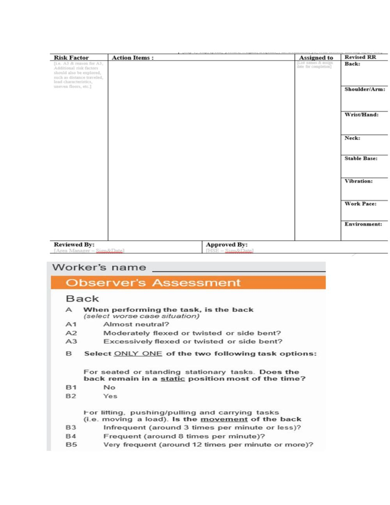
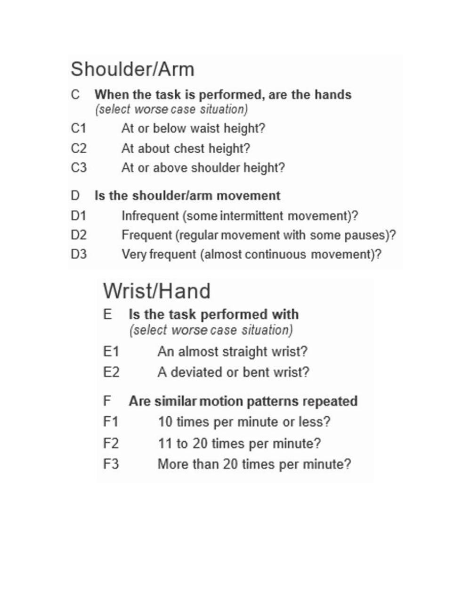
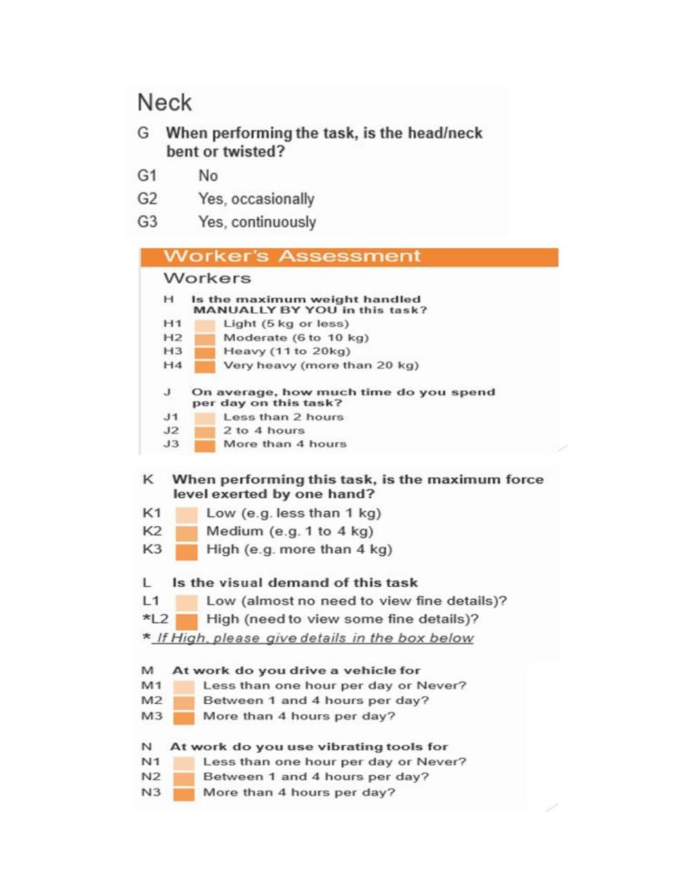
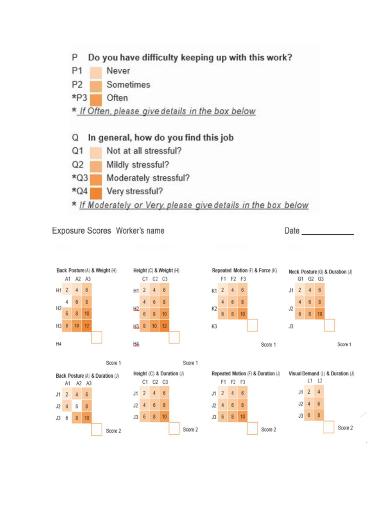
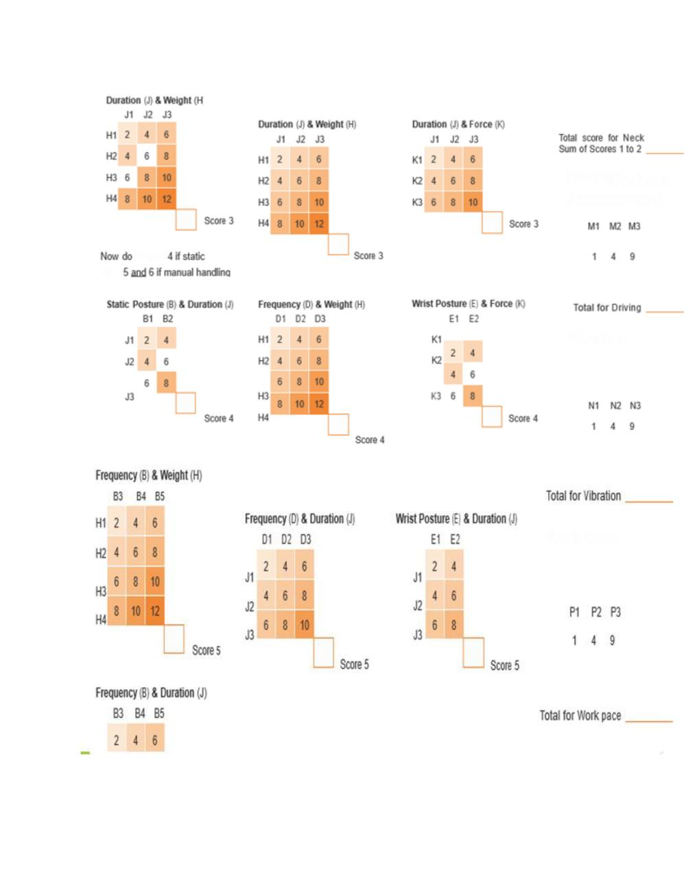
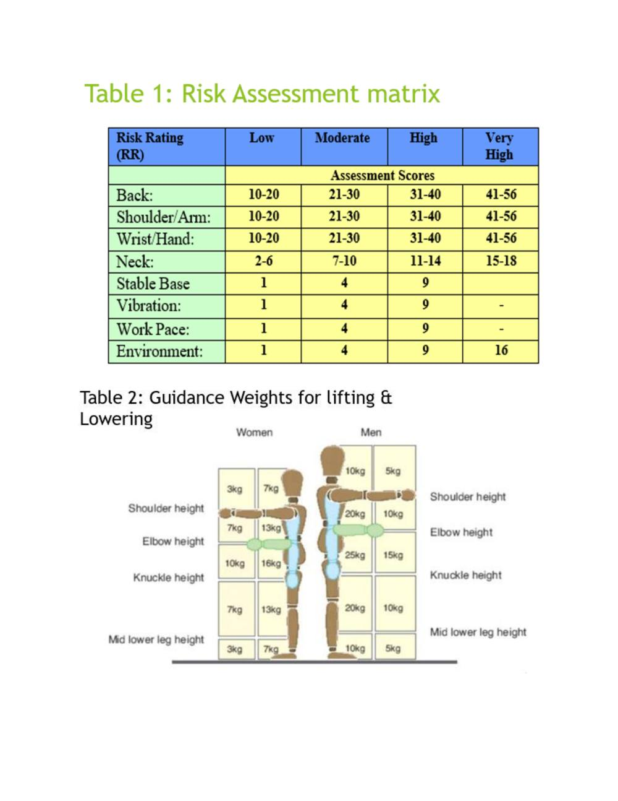
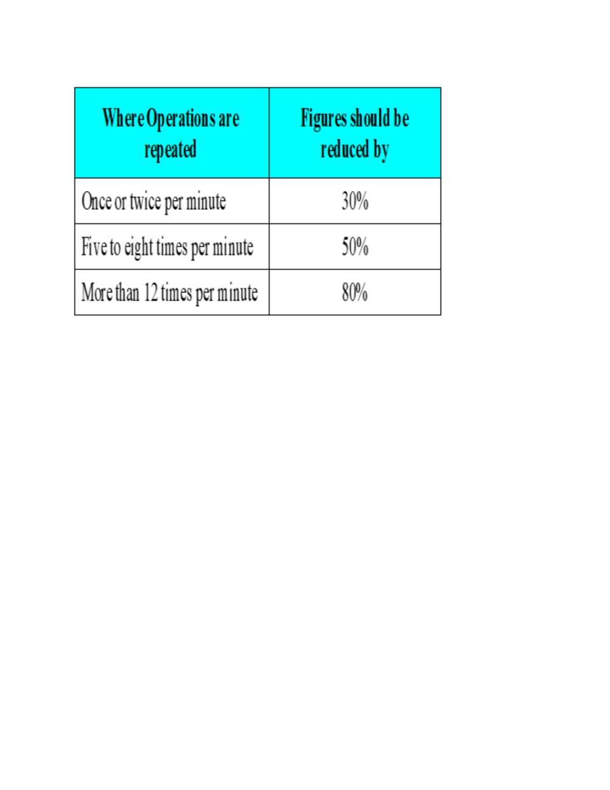

# Ergonomics

> Source: David J. Magee, *Orthopedic Physical Assessment*, 6th ed., and companion MSK assessment material. Paper 3 compilation.

## ERGONOMICS

##  DERIVED FROM GREEK WORDS

##  ERGO + NOMOS = ERGONOMICS

 "work" + "laws" = " laws of work "

##  SCIENTIFIC STUDY OF HUMAN WORK

##  "DESIGNING THE JOB TO FIT THE WORKER , NOT FORCING THE

## WORKER TO FIT THE JOB"

##  SCIENCE THAT DEALS WITH DESIGNING AND ARRANGING

## THINGS SO THAT PEOPLE CAN USE THEM EASILY AND SAFELY

Levels of Ergonomic Risk Assessment  There are three basic levels of ergonomic risk assessment:  Hazard Recognition: A quick screen for MSD hazards at the job level.  Simple Risk Assessment: A more in-depth screen identifying specific ergonomic risk factors for each body segment at the job level.  Objective Assessment: A detailed, objective assessment of a job task using a fully quantitative tool.

## Hazard Recognition

 The goal of the hazard recognition assessment is simply to identify and document the known presence of observed MSD hazards.  The basic MSD hazards are:  High forces exerted by workers  Awkward postures  High repetition  Vibration  Contact stress  Cold temperatures  A hazard recognition tool can be used during your initial worksite tour and also on an ongoing basis as MSD hazards are observed by supervisors, employees, engineers, and the safety/ergonomics team.  Simple Risk Assessment  The goal of the simple risk assessment is to identify and document levels of MSD risk exposure for each segment of the body, resulting in an overall MSD risk score at the job level as well as a list of tasks for further evaluation using an objective tool.  Objective Assessment  The goal of an objective assessment is to quantify exactly the MSD risk exposure present in a job task.  Valid objective assessment tools include:  NIOSH Lifting Equation  WISHA Lifting Calculator  Rapid Entire Body Assessment  Rapid Upper Limb Assessment  Snook Tables

## ERGONOMICS RISK ASSESSMENT IN MUSCULOSKELETAL

## DISORDERS

 Winery Ergonomic Risk Assessment  Scoring the Assessment & Determining Risk  The assessment scores should be used to:  Determine the comparative levels of exposure for each body area  Identify where exposures are highest and focus intervention to such areas  To score the exposure assessment 1. Use the Exposure Scores sheet to determine the scores for each body area. For example, at the top left hand corner of the sheet for the Back:  The first table shows the scores for combinations Posture (A1-3) and Weight (H1-4).  Identify the corresponding exposure combination, e.g. the combination A2 and H2 would score 6, for A3 and H3 score 10. Enter this in the 'Score 1' box at the bottom right-hand corner.  Do this for the correct combination of factors for the back, i.e. by calculating either scores 1 to 5 OR scores 1 to 3 plus score 6 as applicable  Then sum the total scores for the back. 2. Repeat this procedure for each body area and other factors (i.e. vibration etc.). 3. Do this following again any intervention.

## Source pages (figures, tables & slides)

These pages of the original document carry no extractable text (presentation slides, figures, tables or handwritten notes) and are reproduced as images so no source content is lost.

