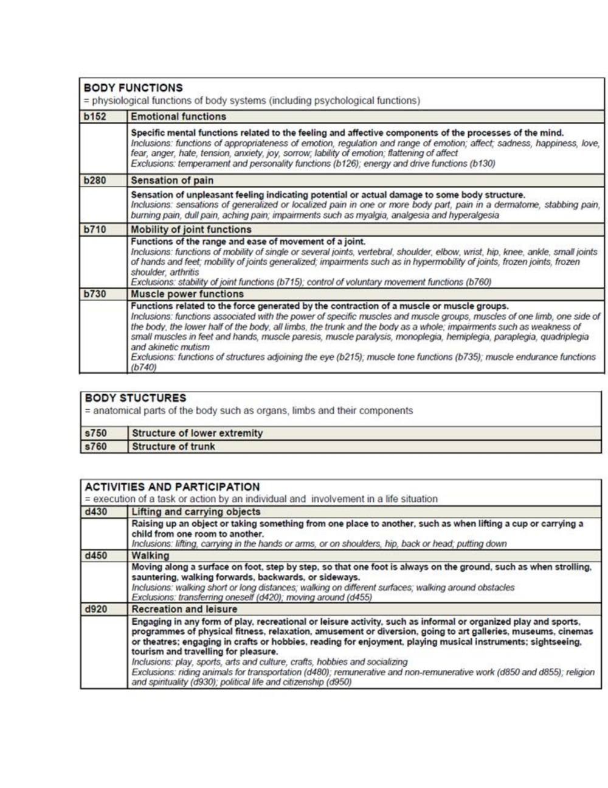
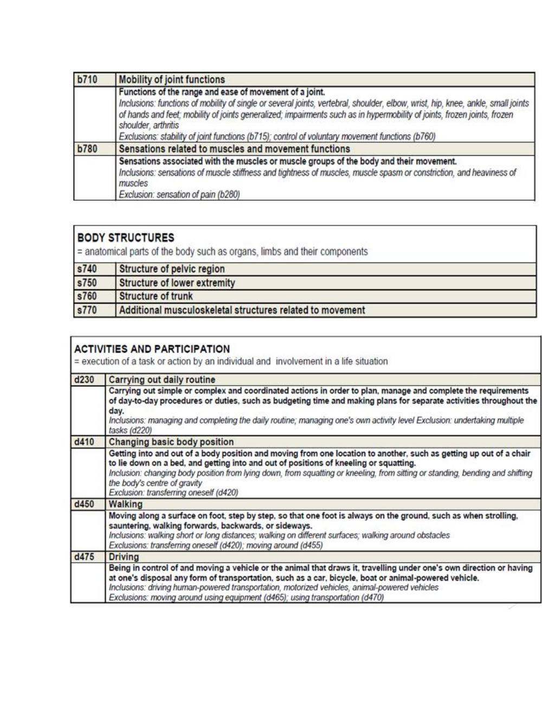
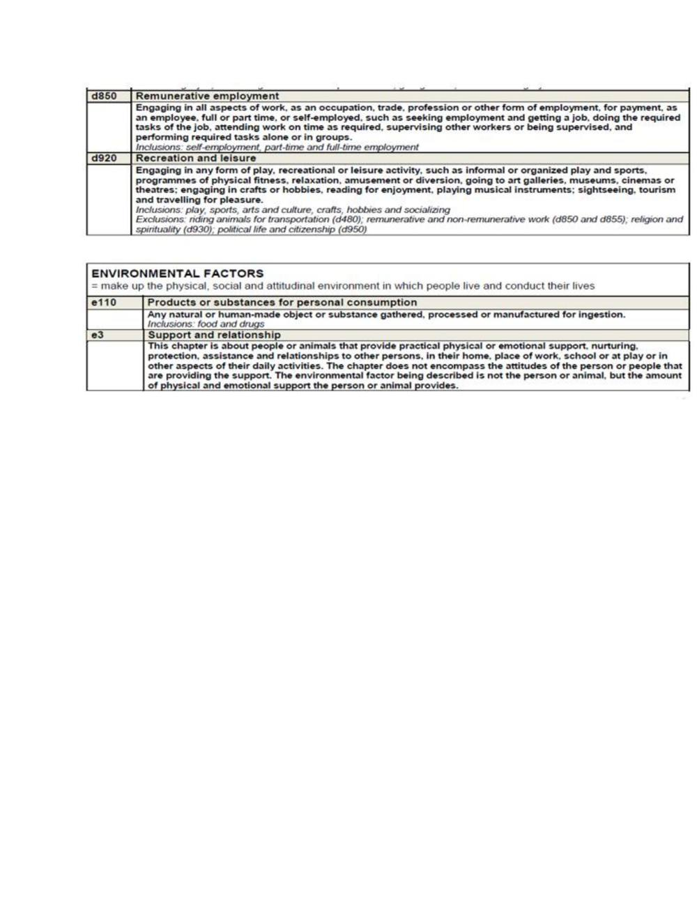

# International Classification of Functioning, Disability and Health (ICF)

> Source: David J. Magee, *Orthopedic Physical Assessment*, 6th ed., and companion MSK assessment material. Paper 3 compilation.

## INTERNATIONAL CLASSIFICATION OF FUNCTIONING, DISABILITY

## AND HEALTH (ICF)

 The International Classification of Functioning, Disability and Health (ICF) is a framework for describing functioning and disability in relation to a health condition.  It provides a common language and framework for describing the level of function of a person within their unique environment or in other words we can, what a person with a specific health condition can do in a standard environment (their level of capacity), also what they actually do in their usual environment (their level of performance).

 The ICF is a framework to approach patient care that shifts the conceptual emphasis away from negative connotations such as disability and places focus on the positive abilities of the individual at the patient level rather than the systems level.  ICF can be used to promote a shared understanding of the influences on functioning and disability.  ICF was chosen as one model that aligned well with the different disciplines and therefore would promote inter professional communication in learning activities.  The ICF reflects the multi dimensions of functioning, disability and health in a model that has relevance across a range of health disciplines, and has the potential to provide a common language in inter professional education.

 ICF provides a systematic means of engaging with patients, carers and interprofessional team members. Enhances respect, collaborative leadership, job satisfaction, trust relationships and accountability between team members, as well as a culture of on-going learning.

## USE OF ICF IN MUSCULOSKELETAL DIAGNOSIS

 Impairments are the problems an individual may have in body function (physiological functions of body systems) or structure (anatomical parts of the body).  Activity limitations are difficulties an individual may have in executing tasks or actions. Activity limitations can include limitations in the performance of cognitive and learning skills, communication skills, functional mobility skills (FMS) (such as transfers, walking, lifting or carrying objects), and activities of daily living (ADL). Basic activities of daily living (BADL) include self- care activities of toileting, hygiene, bathing, dressing, eating, drinking, and social (interpersonal) interactions.

 Performance qualifiers indicate the extent of participation restriction (difficulty) in performing tasks or actions in an individual's current real-life environment.  All aspects of the physical, social, and attitudinal world constitute the environment.  Participation restrictions are problems an individual may experience in involvement in life situations and societal interactions. Categories of life roles include home management, work (job/school/play), and community/leisure.  These include instrumental activities of daily living (IADL) such as housecleaning, preparing meals, shopping, telephoning, and managing finances, as well as work and leisure activities (e.g., sports, recreation, trips).

 Environmental factors make up the physical, social, and attitudinal environment in which people live and function.  Factors range from products and technology (for personal use in daily living, mobility and transportation, communication) and physical factors (home environment, terrain, climate) to social support and relationships (family, friends, personal care providers), attitudes (individual and societal), and institutions and laws (housing, communication, transportation, legal, financial services, and policies).

ICF Core Set for Osteoporosis  With the ICF it is now possible to define the typical spectrum of problems in functioning of patients with osteoporosis under consideration of environmental factors in a more systematic way using a globally agreed-upon language.  The preparatory phase included a systematic literature review, a Delphi exercise and an empirical data collection using the ICF checklist: • The systematic literature review was performed to identify and compare the concepts contained in outcome measures of randomized, controlled clinical trials published from 1991-2000 involving patients with osteoporosis.

• The international expert survey (via email) using the Delphi technique was conducted with 21 health professionals, experts on the treatment of persons with osteoporosis, to identify the set of domains that best describe the prototypical spectrum of problems in functioning and health in persons with osteoporosis from the of health professional perspective. ICF Core Sets for Ankylosing Spondylitis

## Source pages (figures, tables & slides)

These pages of the original document carry no extractable text (presentation slides, figures, tables or handwritten notes) and are reproduced as images so no source content is lost.

